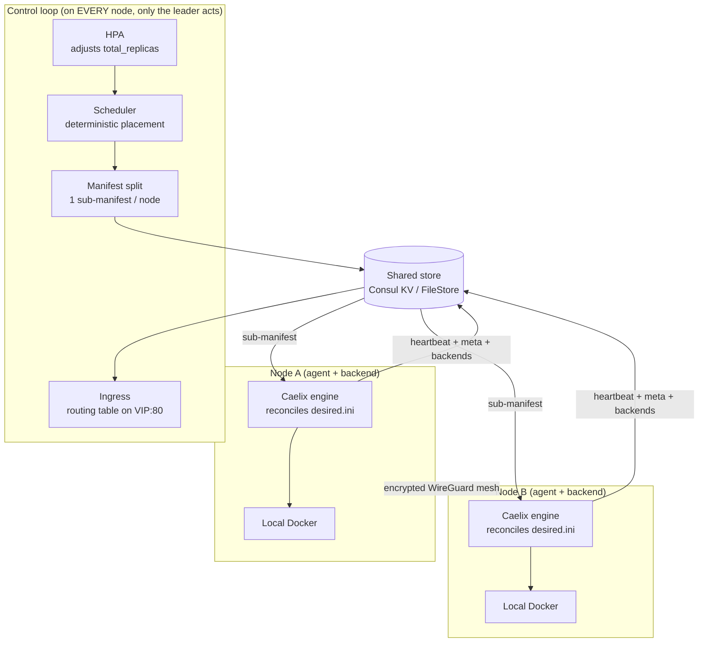

# Multi-node cluster (HA) — Caelix 2.0

| | |
|---|---|
| Availability | Optional; Caelix stays single-host by default |
| Enable | `CAELIX_CLUSTER_BACKEND` variable (`file` or `consul`) |
| Setup | [Getting Started › Cluster](../getting-started/cluster.md) |
| Design decisions | [Multi-node RFC](multi-node-rfc.md) |

This page describes how the Caelix 2.0 cluster works: the control plane, the shared
store, placement, the agent cycle, the floating VIP, failover, ingress, the horizontal
autoscaler (HPA), the shared console state, per-node Docker targeting, and the WireGuard
mesh.

---

## 1. Overview

In cluster mode, Caelix follows a control plane + agents model. The self-healing
engine (`health`, `repair`, blue/green, autoscale) stays the local executor on each
node: it reconciles an INI manifest exactly as in single-host mode, without "knowing"
it is clustered. Above it, a leader-gated control plane decides which node hosts
what, reschedules on failure, adjusts replica counts (HPA), and publishes the ingress
routing table.

Shared state lives in a store (Consul KV in production). A floating VIP follows the
leader to provide a stable access point, and east-west traffic flows over a mandatory
encrypted WireGuard mesh.

Key 2.0 point: every node runs the FastAPI backend with the same control loop, and
leadership (a Consul session lock) designates the single node that acts. No node has a
fixed role; a promoted survivor takes over everything, from placement to the VIP and
ingress.

---

## 2. The leader-gated control plane

All nodes run the FastAPI backend, so all run the control loop (`core/cluster/loop.py`:
`controller_loop` → `controller_tick`). Leadership is a Consul session lock
(`ConsulStore.acquire_leadership`), and only the leader acts. With the `FileStore` (single
controller), that controller is always leader.

On each tick, the leader runs, in order:

1. `hpa_tick`: adjusts the `total_replicas` of autoscaled services from the live CPU
   metric (§8), before scheduling, so the same pass places the new count;
2. `apply_cluster`: reads the cluster manifest and live nodes, schedules placement, and
   writes one sub-manifest per node to the store (§4);
3. `publish_mesh`: renders and publishes the (secret-free) WireGuard directives per
   node (§9).

The loop renews its Consul session each iteration (interval
`CAELIX_CONTROLLER_INTERVAL`, 10 s by default; session TTL ≥ `CAELIX_NODE_TTL`). An HPA
failure is caught and never breaks the control plane.

| Role | Process | Responsibility |
|---|---|---|
| Agent | `lib/node.sh` (on each node's host) | Renews its Consul lease, syncs its sub-manifest, reconciles it with the normal engine, publishes its meta and backends, applies the WireGuard mesh, and reconciles the VIP. |
| Control loop | FastAPI backend (on every node) | Leader-gated: HPA → placement → mesh. Only one leader acts. |

A node holds both at once (backend co-located with the agent). The typical deployment is
3 nodes, each an agent and backend, with 3 Consul servers for quorum.

---

## 3. The shared store

All shared state goes through a store interface, with two implementations selected by
`CAELIX_CLUSTER_BACKEND`:

- `FileStore` (`file`): a local file tree. Dependency-free and single-controller, it
  covers development, tests, and a single-controller "managed" cluster.
- `ConsulStore` (`consul`): Consul KV over its HTTP API (stdlib `urllib`, no extra
  dependency). It brings Raft consensus and leader election (sessions/locks), and it is
  the high-availability backend.

Scheduler, controller, ingress, HPA and liveness are backend-agnostic: they only talk
to the store interface.

The store holds (prefix `caelix/`):

| Key | Contents |
|---|---|
| `cluster/manifest` | Global cluster desired state (JSON) |
| `nodes/<id>/meta` | Node identity: `addr`, labels, `docker_addr`, `wg_pubkey`/`wg_endpoint`, resources |
| `nodes/<id>/heartbeat` | Lease/heartbeat (UTC timestamp) published by the agent |
| `nodes/<id>/desired` | INI sub-manifest pushed by the leader |
| `nodes/<id>/mesh` | (secret-free) WireGuard directives rendered by the leader |
| `nodes/<id>/drain` | Drain flag |
| `services/<app>/backends/<inst>` | Service backend registry `<node_addr>:<hostport>` published by agents |
| `cluster/leader` | Leadership lock (session + `node_id`) |
| `cluster/vip` | Floating VIP published by the leader |
| `console/...` | Shared console state (users, JWT secret, config, templates, stacks, certs); see §7 |

---

## 4. Placement and manifest split

`apply_cluster` (`controller.py`) reads the cluster manifest and the live nodes, then calls
the scheduler and the manifest split.

The scheduler (`scheduler.py`) places each app's `total_replicas` across the nodes. It
is deterministic and constraint-aware:

- deterministic: same input, same output, stable across passes; ordered by app name,
  then nodes sorted by id;
- constraint-aware: it honours `node_affinity`, anti-affinity and `max_per_node`, and it
  balances load (fewest replicas of the app, then lowest total load). When eligible nodes
  are missing, the surplus replicas go to `pending` instead of failing. The first
  replica of an app on a node keeps the bare app name; extra replicas get an `-rN` suffix.

The manifest split (`manifest_split.py`) renders one INI sub-manifest per node, in
the exact shape the agent already reconciles:

- placement-only keys (`total_replicas`, `hpa_*`, affinity, `max_per_node`…) are
  stripped from the per-node section, and the agent sees only a plain service;
- a section with no `health_type` gets `health_type = none` injected, so a bare cluster
  service (for example `image = nginx` deployed from the console) is not repaired to death.
  The container is healthy while it runs, and the ingress independently health-checks each
  backend; an explicit `health_type` always wins;
- reserved sections (`orchestrator`, `proxy`, `notify`, `global`) are propagated
  verbatim to every node.

The agent points `CAELIX_MANIFEST` at its `desired.ini` and runs `reconcile_all`: it
reconciles its sub-manifest exactly as in single-host mode.

---

## 5. The agent cycle (`lib/node.sh`)

The agent runs on each node's host, at the head of every pass (`node_agent_cycle`):

1. Lease renewal (`node_lease_renew`): writes its heartbeat to the store. On failure
   (store unreachable, partition) the agent self-fences (`node_fence_set`). It
   suspends its creates and repairs so it does not double-start workloads the leader is
   rescheduling elsewhere, and releases the VIP. It un-fences as soon as the lease
   returns.
2. Sync (`node_cluster_sync`): generates its WireGuard keys (idempotent), publishes its
   meta, adopts the sub-manifest pushed by the leader, reconciles it, then publishes
   its backends to the registry.
3. Mesh (`node_mesh_ensure`): applies the WireGuard directives (§9).
4. VIP (`node_vip_reconcile`): leader → binds the VIP; non-leader → releases it (§6).

### Backend publication

For each running section of the sub-manifest, the agent parses the `publish` line
(`[ip:]host:container`) to extract the host port, and publishes a backend
`<CAELIX_NODE_ADDR>:<hostport>` under `services/<app>/backends/<node>-<app>`. When the
container is not running, the backend is deregistered. The leader/ingress reads this
registry to route to replicas on any node.

---

## 6. Floating VIP

The VIP (`CAELIX_CLUSTER_VIP`, e.g. `10.0.0.10/32`) is a stable address that follows
the leader:

- the leader's agent adds the VIP to its interface (`CAELIX_VIP_IFACE`, else the
  default-route interface) and sends a gratuitous ARP to refresh the neighbours' L2
  table (`node_vip_bind`);
- non-leaders release it (`node_vip_release`); on lease loss the node also releases it,
  so a healthy node can take it over.

The console (`:18100`) and ingress (`:80`) listen on `0.0.0.0`, so they answer on the
VIP: a stable cluster access point, independent of the current node's IP. The VIP is
published to the store (`cluster/vip`) so a promoted node takes it over without
reconfiguration.

---

## 7. Failover and fencing

- Quorum: with ≥ 3 Consul servers, the 2/3 Raft quorum survives losing one node.
  The leadership lock (`cluster/leader`, session `Behavior=delete`) is auto-released
  when the leader's session expires (crash, partition); a survivor acquires it and its
  agent binds the VIP. Consul's quorum guarantees a single leader, so there is no
  split-brain.
- Liveness: the leader only schedules onto live nodes, meaning those whose heartbeat is
  within the `CAELIX_NODE_TTL` (30 s by default, `liveness.py`). A node that stops beating
  is excluded, and its *stateless* workloads are rescheduled onto the survivors. A
  draining node is also excluded: its movable workloads leave, but a `pinned` app stays
  `pending` there, which blocks the drain's completion.
- Lease-based fencing: a node that loses its lease stops acting as leader and releases
  the VIP. The lease is the authority, so a partitioned-but-alive node does not conflict
  with rescheduling.

---

## 8. Global ingress

The leader runs a global socat reverse proxy on `VIP:80`
(`lib/autoscale_proxy.sh`: `global_proxy_ensure`). It builds routes from the service
registry: each app with an `autoscale_route` key gives a route whose backends are the
`<node_addr>:<hostport>` published by every node running a replica.

- `routes.conf` is regenerated every reconcile pass; the socat handler re-reads it
  per connection, so a route or backend change takes effect without a restart.
- The config hash covers only the listener (`listen` / TLS) and gates only its
  restart, so adding a cluster service never requires restarting the proxy (a circular
  hash once caused 502s).
- On the API side, `build_routes` (`ingress.py`) exposes the same table via
  `GET /api/cluster/routes` (route key → backend addresses, de-duplicated and sorted,
  across all nodes).
- Dead backends are health-checked out by the proxy before routing.

---

## 9. Horizontal autoscaler (HPA)

For each `hpa = 1` service, the leader (`hpa.py`):

1. reads each replica's CPU via `docker stats` targeting the `docker_addr` of the node
   hosting it (the same endpoint as `X-Caelix-Node`), and averages the samples;
2. moves `total_replicas` by ±1 toward `hpa_target` (target CPU %, 60 by default),
   bounded by `[hpa_min, hpa_max]`, after `hpa_cooldown` consecutive over/under ticks;
3. applies asymmetric hysteresis: scale up when the average exceeds the target, scale
   down only when the average falls below target × 0.5 (which avoids flapping).

The scheduler then places the new count and the ingress load-balances, exactly like
changing `total_replicas` by hand, but automatic. Cooldown counters are in-process; a
reset on failover is harmless, since the HPA re-evaluates from the live metric.

---

## 10. Shared console state

`ui/backend/app/core/shared_state.py` is a Consul-KV abstraction (prefix
`caelix/console/`), active in cluster mode (`CAELIX_CLUSTER_BACKEND=consul`), inert in
single-host. Because every node runs the console, console-managed state must be
coherent across nodes and survive failover:

- users, JWT secret, single-file config, templates, Compose stacks and `.env`,
  TLS certificates.

Disk-bound content (Compose files, PEMs) is materialized to local disk
(`materialize_dir`) before the disk-bound tool (`docker compose`, the proxy) uses it.
Without this sharing, a VIP failover would land the operator on a different node with a
different password, invalidated sessions and divergent config.

---

## 11. Per-node Docker targeting

In cluster mode, any Docker-backed operation can target a specific node:

1. The console attaches the `X-Caelix-Node: <id>` header to the relevant calls.
2. The backend resolves that node's `docker_addr` (validated `tcp://host:port` or
   `unix://`, published in its meta) and runs the Docker command against that daemon.
3. `dockerd` is exposed over TCP on the node's private IP (`tcp://<ip>:2375`, set by
   `node_write_cluster_env`); in production, restrict it to the WireGuard subnet with
   mTLS.

Containers, images, volumes, networks, stacks, logs and metrics thus target the right
daemon. HPA reuses the same `docker_addr` to read replica CPU.

---

## 12. WireGuard mesh

East-west traffic flows over a mandatory encrypted WireGuard underlay, not over host
ports:

- each node generates its key pair locally (`node_mesh_keygen`); the private key
  never leaves the node, and only `wg_pubkey` and `wg_endpoint` go into the meta;
- the leader renders the (secret-free) mesh directives per node and publishes them
  (`publish_mesh`);
- the agent applies the directives every cycle (`node_mesh_ensure`), idempotently
  (hash): it re-applies only if they change or if the interface disappeared (for example
  after a host reboot), so the mesh survives reboots.

The system application (`wg` / `ip`) requires root; `wg` is mandatory on a cluster node
(the installer requires it).

---

## 13. Module map

| Component | Module | Role |
|---|---|---|
| Control loop | `cluster/loop.py` | Leader lock + tick (HPA → placement → mesh) |
| Controller action | `cluster/controller.py` | `apply_cluster`, `publish_mesh`, drain |
| Store | `cluster/consul_store.py`, `cluster/store.py` (FileStore), `factory.py` | Consul KV / file + selection |
| Placement | `cluster/scheduler.py` | Deterministic, constraint-aware placement |
| Split | `cluster/manifest_split.py` | Per-node INI sub-manifest |
| Liveness | `cluster/liveness.py` | Heartbeat / live nodes |
| HPA | `cluster/hpa.py` | CPU-driven horizontal autoscaler |
| Ingress (table) | `cluster/ingress.py` | `build_routes` → `GET /api/cluster/routes` |
| Ingress (proxy) | `lib/autoscale_proxy.sh` | Global socat proxy on `VIP:80` |
| Mesh | `cluster/mesh.py`, `lib/node.sh` | WireGuard directives + application |
| Shared console state | `core/shared_state.py` | Consul-KV `caelix/console/` |
| Agent | `lib/node.sh` | Lease, sync, backends, mesh, VIP, fencing |

---

## 14. Security

- mTLS on the control plane, per-node Consul ACL (token `CAELIX_CONSUL_TOKEN`).
- Lease = authority (fencing): a node without a lease does not reconcile and releases
  the VIP.
- WireGuard private keys: generated on the node, never transmitted.
- Consul quorum: `Behavior=delete` session lock, so a single leader and no split-brain.
- Remote Docker endpoint: in production, restrict it to the WireGuard subnet with mTLS
  (the test bench exposes it over plain TCP on an isolated network).
