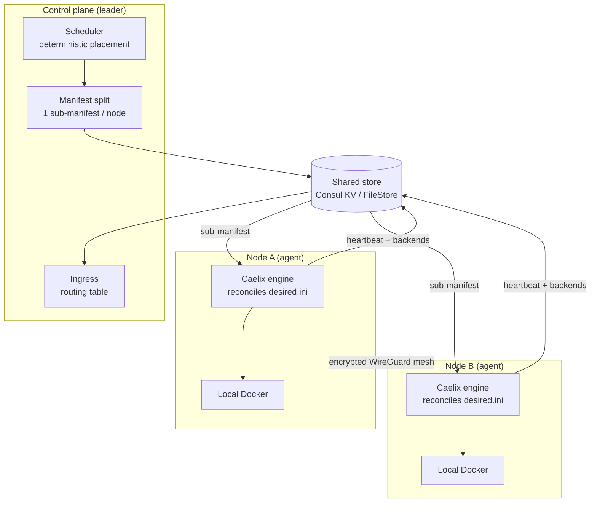

# Multi-node cluster (HA)

| | |
|---|---|
| **Availability** | Optional — Caelix stays single-host by default |
| **Enable** | `CAELIX_CLUSTER_BACKEND` variable (`file` or `consul`) |
| **Setup** | [Getting Started › Cluster](../getting-started/cluster.md) |
| **Design decisions** | [Multi-node RFC](multi-node-rfc.md) |

This page describes **how** the Caelix cluster works: its components, data flow, and
high-availability mechanisms.

---

## 1. Overview

In cluster mode, Caelix follows a **controller + agents** model. The self-healing
engine (`health`, `repair`, blue/green, autoscale) stays the **local executor** on
each node; a **control plane** decides *which node hosts what* and *reschedules* on
failure. Shared state lives in a **store**; inter-node traffic flows over an
**encrypted WireGuard mesh**.

---

## 2. Roles: agent and controller

| Role | Process | Responsibility |
|---|---|---|
| **Agent** | `caelix agent` (on every node) | Reconciles its local sub-manifest, publishes its identity, heartbeat and backends, applies the WireGuard mesh. |
| **Controller** | FastAPI backend with `CAELIX_CONTROLLER=1` | Reads the desired state + live nodes, schedules placement, writes one sub-manifest per node. **Leader-elected**: only one controller acts at a time. |

A node can hold both roles at once (controller co-located with an agent). The typical
deployment: 3 nodes, each an agent, one of them the leader.

---

## 3. The shared store

All shared state goes through a **store interface** (`core/cluster/store.py`), with
two implementations selected by `CAELIX_CLUSTER_BACKEND`:

- **`FileStore`** (`file`) — a local file tree. Dependency-free,
  **single-controller**: development, tests, a single-controller "managed" cluster.
- **`ConsulStore`** (`consul`) — Consul KV. Brings **Raft consensus**, **leader
  election** (sessions/locks), service discovery and health checks. This is the
  **high availability** backend.

Scheduler, controller, ingress and liveness are **backend-agnostic**: they only talk
to the store interface.

Key layout (RFC §9):

| Key | Contents |
|---|---|
| `cluster/manifest.ini` | Global desired state (INI) |
| `nodes/<id>/meta` | Node identity: address, labels, `docker_addr`, WireGuard key/endpoint |
| `nodes/<id>/status` | Heartbeat + observed state published by the agent |
| `nodes/<id>/desired.ini` | Sub-manifest pushed by the controller |
| `backends/<app>/<node>` | Healthy backends published for the ingress |

---

## 4. Placement and sub-manifests

The **scheduler** (`scheduler.py`) takes the per-app placement specs and the list of
registered nodes, and decides which node hosts each replica. It is:

- **deterministic** — same input → same output, stable across passes;
- **constraint-aware** — node affinity, anti-affinity / `max_per_node`; when eligible
  nodes are missing, replicas go to `pending` instead of failing.

The **manifest split** (`manifest_split.py`) turns that plan into **one INI
sub-manifest per node**, in the exact shape the agent already reconciles. Reserved
sections (`orchestrator`, `proxy`, `notify`, `global`) are propagated to every node;
each app is emitted under its placed instance name, stripped of the cluster-only
placement keys.

The agent points `CAELIX_MANIFEST` at its `desired.ini` and runs `reconcile_all`: it
reconciles its sub-manifest **exactly as in single-host mode**.

---

## 5. High availability

### 5.1 Leader election

The controller loop (`loop.py`) runs on the control nodes (`CAELIX_CONTROLLER=1`). On
each tick it **renews its Consul session** and tries to **acquire the leadership
lock**. Only the leader reschedules; followers are read-only. With `FileStore`, the
single controller is always leader.

### 5.2 Heartbeat & liveness

Each agent renews a **heartbeat** (UTC timestamp) in the store every cycle. A node is
**alive** as long as its heartbeat is within the TTL (`CAELIX_NODE_TTL`, 30 s by
default). The controller only schedules onto live nodes (`liveness.py`): if a node
stops beating, it is **excluded** and its *stateless* workloads are **rescheduled
onto the survivors**.

### 5.3 Lease-based fencing

Before each pass, the agent **renews its cluster lease**. **If the lease is lost**
(store unreachable, network partition), the agent **self-fences** and **skips
reconciliation**. The "the lease is the authority" principle: a partitioned-but-alive
node does not conflict with the leader's rescheduling.

---

## 6. Network: WireGuard mesh

East-west traffic flows over an **encrypted WireGuard underlay** (`mesh.py`), not over
host ports:

- each node is assigned a **deterministic container subnet** `10.42.<n>.0/24`;
- each node publishes its WireGuard **public key** and **endpoint** in its meta
  (`wg_pubkey` / `wg_endpoint`) — **the private key never leaves the node**;
- a node's `wg0.conf` is rendered from its peers' metas.

The system application (`wg` / `ip`) is done by `caelix mesh-keygen` / `mesh-up` /
`mesh-down` (root required).

---

## 7. Ingress

Agents publish their **backends** (addresses of healthy containers) in the store. The
**ingress** (`ingress.py`) reads that registry and produces the cluster-wide
**routing table**: for each app, its route key (`autoscale_route` or the app name)
mapped to the de-duplicated, sorted list of its backends across all nodes. The
**Caelix proxy** is regenerated from this table, reusing the existing certbot/domain
integration.

---

## 8. Volumes (stateful)

- **`pinned`** (safe default): the volume lives on one node, the app is pinned there.
- **`shared`**: an **NFSv4** volume whose traffic flows over the WireGuard mesh,
  usable from any node.
- **Drain**: a node can be *drained* (made unschedulable) for maintenance; its
  workloads are rescheduled elsewhere.

---

## 9. Targeting a node

In cluster mode, any Docker-backed operation can target a specific node:

1. The console attaches the `X-Caelix-Node: <id>` header to the relevant calls.
2. The `NodeTargetMiddleware` (`main.py`) resolves the node's Docker endpoint
   (`docker_addr`, published in its meta) and stores it in a `ContextVar` for the
   request's lifetime.
3. `docker_target_env` (`core/docker.py`) prefers that contextvar over
   `CAELIX_DOCKER_HOST` and sets `DOCKER_HOST` / `CONTAINER_HOST`. Because **every**
   Docker operation flows through `run_cmd`, containers, images, volumes, networks,
   stacks, logs, metrics and deployments target the right daemon.
4. The state caches (`core/state.py`) are **keyed by targeted node** (`""` = local),
   so a view never mixes two nodes' data.

**Non-Docker** endpoints (the controller process's own system metrics, local backup)
stay **controller-local**: they describe the controller, not a remote daemon.
Per-node metrics come from the cluster status and the heartbeat.

---

## 10. Module map

| Component | Module | Role |
|---|---|---|
| Docker target | `core/docker.py` | `docker_target_env` / `run_cmd` — routing to the targeted daemon |
| Agent identity & cycle | `lib/node.sh`, `bin/caelix` | meta/status, heartbeat, lease, backends, mesh |
| Store | `store.py`, `consul_store.py`, `factory.py` | FileStore / ConsulStore + selection |
| Placement | `scheduler.py` | Deterministic, constraint-aware placement |
| Sub-manifests | `manifest_split.py` | Splits the desired state per node |
| Control reconciliation | `controller.py`, `loop.py` | Controller pass + leader loop |
| Liveness | `liveness.py` | Heartbeat / live nodes / rescheduling |
| Network | `mesh.py` | Subnets and WireGuard configuration |
| Ingress | `ingress.py` | Cluster routing table |
| Node targeting | `main.py`, `core/state.py` | `X-Caelix-Node` middleware + per-node caches |

---

## 11. Security

- **mTLS** on the control plane, per-node **Consul ACL**.
- **Lease = authority** (fencing): a node without a lease does not reconcile.
- **WireGuard private keys**: generated on the node, **never transmitted**.
- Remote Docker endpoint: in production, **restrict it to the WireGuard subnet +
  mTLS** (the test bench exposes it over plain TCP on an isolated network).
