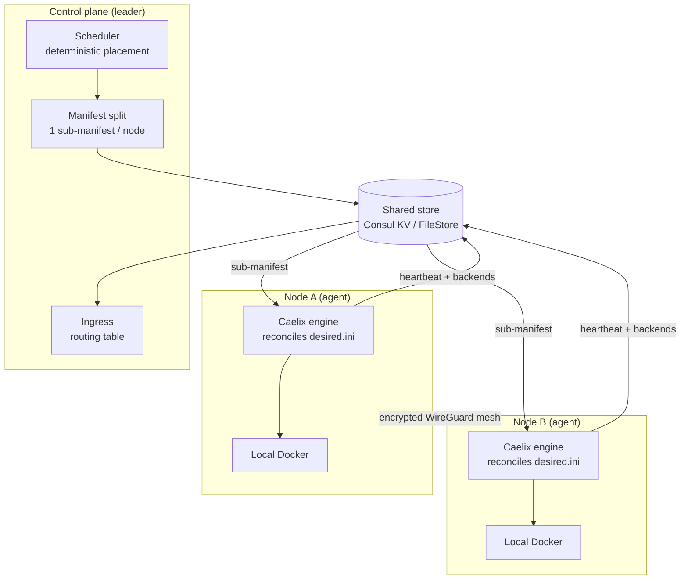

# Multi-node cluster (HA)

| | |
|---|---|
| **Status** | Implemented |
| **Mode** | Optional — Caelix stays single-host by default |
| **Design** | See the [multi-node RFC](multi-node-rfc.md) for decisions and alternatives |

This page explains **how** the Caelix cluster works and **how it was built**, layer
by layer. For the hands-on setup (enable the mode, add a node), see the
[Getting Started › Cluster](../getting-started/cluster.md) guide.

---

## 1. Principle

By default Caelix is a **single-host** orchestrator: the Bash engine reconciles a
`manifest.ini` against the **local** Docker daemon. Cluster mode **does not replace**
that engine — it wraps it.

The guiding idea: **keep the self-healing engine** (`health`, `repair`, blue/green,
autoscale) as a **local executor on every node**, and add a **control plane** on top
that decides *which node hosts what* and *reschedules* on failure. The engine does
not even know it is clustered: it receives a sub-manifest and reconciles it as usual.

---

## 2. The two roles

| Role | Process | Responsibility |
|---|---|---|
| **Agent** | `caelix agent` (on every node) | Reconciles its local sub-manifest, publishes its identity, heartbeat and backends, applies the WireGuard mesh. |
| **Controller** | FastAPI backend with `CAELIX_CONTROLLER=1` | Reads the desired state + live nodes, schedules placement, writes one sub-manifest per node. **Leader-elected**: only one controller acts at a time. |

A node can be both at once (the controller co-located with an agent), which is the
typical deployment: 3 nodes, each an agent, one of them the leader.

---

## 3. The store: the shared source of truth

All shared state goes through a **store abstraction** (`core/cluster/store.py`) with
two interchangeable implementations, selected by `CAELIX_CLUSTER_BACKEND`:

- **`FileStore`** — a local file tree. Simple, dependency-free, **single
  controller**: ideal for development, tests and a single-controller "managed"
  cluster.
- **`ConsulStore`** — Consul KV. Brings **Raft consensus**, **leader election**
  (sessions/locks), service discovery and health checks. This is the **high
  availability** backend.

The rest of the code (scheduler, controller, ingress, liveness) is
**backend-agnostic**: it only talks to the store interface. That is what allowed
shipping on the FileStore first, then wiring Consul in without rewriting the logic.

Key layout (RFC §9): `cluster/manifest.ini` (global desired state),
`nodes/<id>/meta`, `nodes/<id>/status`, `nodes/<id>/desired.ini` (pushed
sub-manifest), `backends/<app>/<node>`, etc.

---

## 4. From the global manifest to the nodes

The **scheduler** (`scheduler.py`) is **pure** logic (no I/O): given the per-app
placement specs and the registered nodes, it decides which node hosts each replica.
It is:

- **deterministic** — same input → same output, stable across passes;
- **constraint-aware** — node affinity, anti-affinity / `max_per_node`, and when
  eligible nodes are missing, replicas go to `pending` instead of crashing.

The **manifest split** (`manifest_split.py`) then turns that plan into **one INI
sub-manifest per node**, in the exact shape the agent already reconciles. Reserved
sections (`orchestrator`, `proxy`, `notify`, `global`) are propagated to every node;
each app is emitted under its placed instance name, stripped of the cluster-only
placement keys.

The result: **the agent does not know it is clustered**. It simply points
`CAELIX_MANIFEST` at its `desired.ini` and runs `reconcile_all` — exactly like in
single-host mode.

---

## 5. High availability

Three mechanisms, shipped together (phase 4):

### 5.1 Leader election

The controller loop (`loop.py`) runs on the control nodes (`CAELIX_CONTROLLER=1`).
On each tick it **renews its Consul session** and tries to **acquire the leadership
lock**. Only the leader reschedules; followers are read-only. With the `FileStore`
there is a single controller, so it is always leader.

### 5.2 Heartbeat & liveness

Each agent renews a **heartbeat** (a UTC timestamp) in the store every cycle. A node
is **alive** as long as its heartbeat is within the TTL (`CAELIX_NODE_TTL`, 30 s by
default). The controller only schedules onto live nodes (`liveness.py`): if a node
stops beating, it is **excluded** and its *stateless* workloads are **rescheduled
onto the survivors**.

### 5.3 Lease-based fencing

Before each pass, the agent **renews its cluster lease**. **If the lease is lost**
(store unreachable, network partition), the agent **self-fences** and **skips
reconciliation** instead of carrying on blindly. This is the "the lease is the
authority" principle: it prevents a partitioned-but-alive node from conflicting with
the leader's rescheduling.

---

## 6. The network: WireGuard mesh

East-west traffic flows over an **encrypted WireGuard underlay** (`mesh.py`), not
over host ports. Pure logic on the planning side:

- each node is assigned a **deterministic container subnet** `10.42.<n>.0/24`;
- each node publishes its WireGuard **public key** and **endpoint** in its meta
  (`wg_pubkey` / `wg_endpoint`) — **the private key never leaves the node**;
- the module renders a node's `wg0.conf` from its peers' metas.

The system application (`wg` / `ip`) is done by the `caelix mesh-keygen` /
`mesh-up` / `mesh-down` commands (root required), kept separate from the planning
logic so it stays testable.

---

## 7. Ingress

Agents publish their **backends** (addresses of healthy containers) in the store. The
**ingress** (`ingress.py`) reads that registry and produces the cluster-wide
**routing table**: for each app, its route key (`autoscale_route` or the app name)
mapped to the de-duplicated, sorted list of its backends across all nodes. The
**existing Caelix proxy** is regenerated from this table — reusing the certbot/domain
integration rather than adding a second TLS system.

---

## 8. Stateful

- **`pinned`** (safe default): the volume lives on one node, the app is pinned there.
- **`shared`**: an **NFSv4** volume whose traffic flows over the WireGuard mesh,
  usable from any node.
- **Drain**: a node can be *drained* (marked unschedulable) for maintenance; its
  workloads are rescheduled elsewhere.

---

## 9. Targeting a node from the orchestrator and UI

Once the cluster was in place, **every function** of the orchestrator and console
had to be able to act on a specific node. The solution is a **single mechanism** (the
"keystone"), rather than editing every endpoint:

1. **Request header** — the console attaches `X-Caelix-Node: <id>` to Docker-backed
   calls.
2. **ASGI middleware** (`NodeTargetMiddleware`) — reads that header, resolves the
   node's Docker endpoint (`docker_addr`, published in its meta) and sets a
   **`ContextVar`** for the request's lifetime.
3. **`docker_target_env`** — prefers that contextvar over `CAELIX_DOCKER_HOST` and
   sets `DOCKER_HOST` / `CONTAINER_HOST`. Because **every** Docker operation flows
   through `run_cmd`, containers, images, volumes, networks, stacks, logs, metrics
   and deployments automatically target the right daemon — **without touching each
   router**. `asyncio.to_thread` copies the context, so the worker thread sees the
   target.
4. **Per-node caches** — the state caches (`_cached`, containers, stats) are keyed by
   targeted node (`""` = local controller), so a view never mixes two nodes' data.
5. **UI selector** — a menu in the header (visible in cluster mode) picks the node;
   the choice is persisted and reloads the views against its daemon.

**Non-Docker** endpoints (the controller process's own system metrics, local backup)
stay deliberately "controller-local": they describe the controller, not a remote
daemon. Real per-node metrics come from the cluster status and the agent heartbeat.

---

## 10. How it was built (in phases)

Each phase has its own value and was shipped + tested in isolation.

| Phase | Contribution | Key modules |
|---|---|---|
| **0 — Docker target** | `CAELIX_DOCKER_HOST` → `DOCKER_HOST`, everything via `run_cmd`. Foundation of remote targeting. | `core/docker.py` |
| **1 — Agent** | `caelix agent` mode: node identity, meta/status publication. | `lib/node.sh`, `bin/caelix` |
| **2 — Control plane** | Store + scheduler + manifest split + single controller action. | `store.py`, `scheduler.py`, `manifest_split.py`, `controller.py` |
| **3 — Network & ingress** | WireGuard mesh + routing-table building. | `mesh.py`, `ingress.py` |
| **4 — HA** | Leader election (Consul sessions), heartbeat/liveness, rescheduling, fencing. | `loop.py`, `liveness.py`, `consul_store.py` |
| **5 — Stateful** | `shared` NFSv4 volume, node drain. | NFS driver, `controller.py` |
| **Keystone** | Per-request targeting (`X-Caelix-Node`) + per-node caches + UI selector. | `main.py`, `factory.py`, `state.py` |

The whole thing was **validated on a real 3-node bench** (Incus VMs on the VPS, real
Consul + WireGuard) — see [Getting Started › Cluster](../getting-started/cluster.md#6-incus-test-bench).

---

## 11. Security

- **mTLS** everywhere on the control plane, per-node **Consul ACL**.
- **Lease = authority** (fencing): a node without a lease does not reconcile.
- **WireGuard private keys**: generated on the node, **never transmitted**.
- Remote Docker endpoint: in production, **restrict it to the WireGuard subnet +
  mTLS** (the test bench exposes it over plain TCP on an isolated network, see the
  guide).
