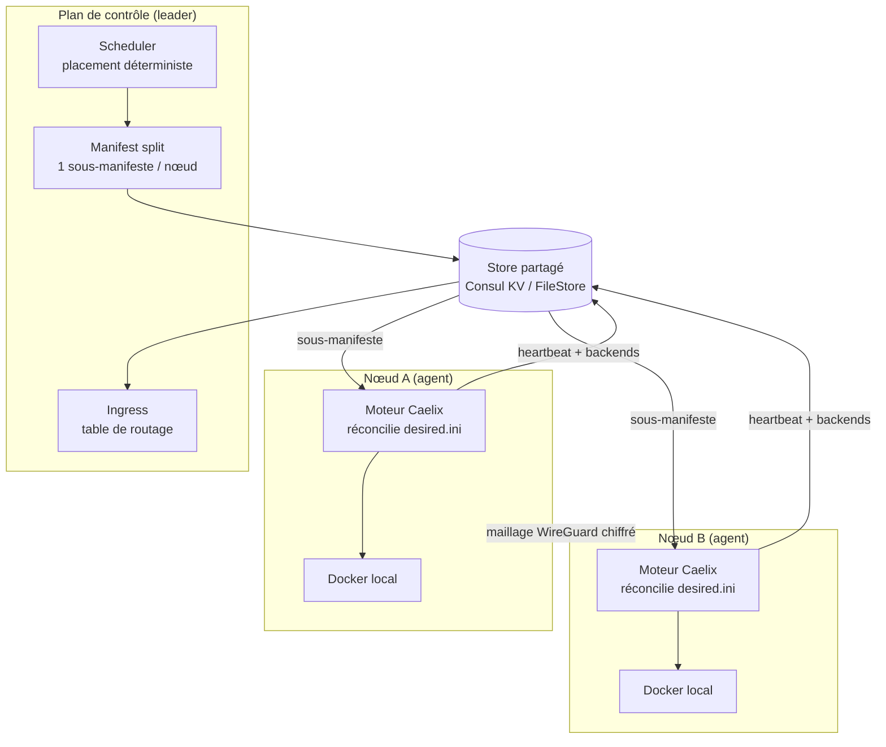

# Cluster multi-nœud (HA)

| | |
|---|---|
| **Statut** | Implémenté |
| **Mode** | Optionnel — Caelix reste mono-hôte par défaut |
| **Conception** | Voir la [RFC multi-nœud](multi-node-rfc.md) pour les décisions et alternatives |

Cette page explique **comment fonctionne** le cluster Caelix et **comment il a été
construit**, couche par couche. Pour la mise en place pratique (activer le mode,
ajouter un nœud), voir le guide [Démarrage › Cluster](../getting-started/cluster.md).

---

## 1. Principe

Caelix est, par défaut, un orchestrateur **mono-hôte** : le moteur Bash réconcilie
un `manifest.ini` contre le démon Docker **local**. Le mode cluster **ne remplace
pas** ce moteur — il l'enveloppe.

L'idée directrice : **garder le moteur auto-réparateur** (`health`, `repair`,
blue/green, autoscale) comme **exécuteur local sur chaque nœud**, et ajouter
au-dessus un **plan de contrôle** qui décide *quel nœud héberge quoi* et
*replanifie* en cas de panne. Le moteur ne sait même pas qu'il est en cluster :
il reçoit un sous-manifeste et le réconcilie comme d'habitude.

---

## 2. Les deux rôles

| Rôle | Processus | Responsabilité |
|---|---|---|
| **Agent** | `caelix agent` (sur chaque nœud) | Réconcilie son sous-manifeste local, publie son identité, son heartbeat et ses backends, applique le maillage WireGuard. |
| **Controller** | backend FastAPI avec `CAELIX_CONTROLLER=1` | Lit l'état désiré + les nœuds vivants, planifie le placement, écrit un sous-manifeste par nœud. **Élu leader** : un seul controller agit à la fois. |

Un nœud peut être les deux à la fois (le controller co-localisé avec un agent),
ce qui est le déploiement typique : 3 nœuds, chacun agent, dont un est le leader.

---

## 3. Le store : la source de vérité partagée

Tout l'état partagé passe par une **abstraction de store** (`core/cluster/store.py`),
qui a deux implémentations interchangeables, choisies par `CAELIX_CLUSTER_BACKEND` :

- **`FileStore`** — un arbre de fichiers local. Simple, sans dépendance, **un seul
  controller** : parfait pour le développement, les tests et un cluster « managé »
  mono-controller.
- **`ConsulStore`** — Consul KV. Apporte le **consensus Raft**, l'**élection de
  leader** (sessions/locks), la *service-discovery* et les health-checks. C'est le
  backend de la **haute disponibilité**.

Le reste du code (scheduler, controller, ingress, liveness) est **agnostique du
backend** : il ne parle qu'à l'interface du store. C'est ce qui a permis de livrer
d'abord en FileStore puis de brancher Consul sans réécrire la logique.

Disposition des clés (RFC §9) : `cluster/manifest.ini` (état désiré global),
`nodes/<id>/meta`, `nodes/<id>/status`, `nodes/<id>/desired.ini` (sous-manifeste
poussé), `backends/<app>/<node>`, etc.

---

## 4. Du manifeste global aux nœuds

Le **scheduler** (`scheduler.py`) est de la logique **pure** (aucune I/O) : on lui
donne les specs de placement par application et la liste des nœuds enregistrés, il
décide quel nœud héberge chaque réplica. Il est :

- **déterministe** — même entrée → même sortie, stable entre les passes ;
- **contraint** — affinité de nœud, anti-affinité / `max_per_node`, et si les nœuds
  éligibles manquent, les réplicas vont en `pending` au lieu de planter.

Le **manifest split** (`manifest_split.py`) transforme ensuite ce plan en **un
sous-manifeste INI par nœud**, dans la forme exacte que l'agent réconcilie déjà.
Les sections réservées (`orchestrator`, `proxy`, `notify`, `global`) sont
propagées à tous les nœuds ; chaque application est émise sous le nom de son
instance placée, débarrassée des clés de placement propres au cluster.

Résultat : **l'agent ne sait pas qu'il est clustérisé**. Il pointe simplement
`CAELIX_MANIFEST` sur son `desired.ini` et lance `reconcile_all` — exactement comme
en mono-hôte.

---

## 5. Haute disponibilité

Trois mécanismes, livrés ensemble (phase 4) :

### 5.1 Élection de leader

La boucle controller (`loop.py`) tourne sur les nœuds de contrôle
(`CAELIX_CONTROLLER=1`). À chaque tick, elle **renouvelle sa session Consul** et
tente d'**acquérir le verrou de leadership**. Seul le leader replanifie ; les
followers sont en lecture seule. Avec le `FileStore`, il y a un seul controller,
donc il est toujours leader.

### 5.2 Heartbeat & liveness

Chaque agent renouvelle un **heartbeat** (un horodatage UTC) dans le store à chaque
cycle. Un nœud est **vivant** tant que son heartbeat tient dans le TTL
(`CAELIX_NODE_TTL`, 30 s par défaut). Le controller ne planifie que sur les nœuds
vivants (`liveness.py`) : si un nœud cesse de battre, il est **exclu** et ses
charges *stateless* sont **replanifiées sur les survivants**.

### 5.3 Fencing par bail

Avant chaque passe, l'agent **renouvelle son bail** cluster. **Si le bail est perdu**
(store injoignable, partition réseau), l'agent **se clôture lui-même** (*self-fence*)
et **saute la réconciliation** au lieu de continuer aveuglément. C'est le principe
« le bail fait autorité » : on évite qu'un nœud partitionné mais encore vivant entre
en conflit avec le replanning du leader.

---

## 6. Le réseau : maillage WireGuard

Le trafic est-ouest passe par un **underlay WireGuard chiffré** (`mesh.py`), pas par
les ports de l'hôte. Logique pure côté planification :

- chaque nœud se voit attribuer un **sous-réseau conteneur déterministe**
  `10.42.<n>.0/24` ;
- chaque nœud publie sa **clé publique** et son **endpoint** WireGuard dans sa meta
  (`wg_pubkey` / `wg_endpoint`) — **la clé privée ne quitte jamais le nœud** ;
- le module rend le `wg0.conf` d'un nœud à partir des metas de ses pairs.

L'application système (`wg` / `ip`) se fait par les commandes
`caelix mesh-keygen` / `mesh-up` / `mesh-down` (root requis), séparées de la logique
de planification pour rester testables.

---

## 7. L'ingress

Les agents publient leurs **backends** (adresses des conteneurs sains) dans le store.
L'**ingress** (`ingress.py`) lit ce registre et produit la **table de routage**
cluster : pour chaque application, sa clé de route (`autoscale_route` ou le nom de
l'app) mappée vers la liste dédupliquée et triée de ses backends, tous nœuds
confondus. Le **proxy Caelix existant** est régénéré depuis cette table — on réutilise
l'intégration certbot/domaines plutôt que d'ajouter un second système TLS.

---

## 8. Stateful

- **`pinned`** (défaut sûr) : le volume vit sur un nœud, l'app y est épinglée.
- **`shared`** : volume **NFSv4** dont le trafic passe sur le maillage WireGuard,
  utilisable depuis n'importe quel nœud.
- **Drain** : on peut *vider* un nœud (le marquer non-planifiable) pour une
  maintenance ; ses charges sont replanifiées ailleurs.

---

## 9. Cibler un nœud depuis l'orchestrateur et l'UI

Une fois le cluster en place, il fallait que **chaque fonction** de l'orchestrateur
et de la console puisse agir sur un nœud précis. La solution est un **mécanisme
unique** (la « clé de voûte »), plutôt qu'une modification de chaque endpoint :

1. **En-tête de requête** — la console attache `X-Caelix-Node: <id>` aux appels
   adossés à Docker.
2. **Middleware ASGI** (`NodeTargetMiddleware`) — lit cet en-tête, résout l'endpoint
   Docker du nœud (`docker_addr`, publié dans sa meta) et pose une **`ContextVar`**
   pour la durée de la requête.
3. **`docker_target_env`** — privilégie cette contextvar sur `CAELIX_DOCKER_HOST` et
   positionne `DOCKER_HOST` / `CONTAINER_HOST`. Comme **toute** opération Docker
   passe par `run_cmd`, conteneurs, images, volumes, réseaux, stacks, logs, métriques
   et déploiements ciblent automatiquement le bon démon — **sans toucher chaque
   routeur**. `asyncio.to_thread` copie le contexte, donc le thread worker voit la
   cible.
4. **Caches clés par nœud** — les caches d'état (`_cached`, conteneurs, stats) sont
   indexés par nœud ciblé (`""` = controller local), pour qu'une vue ne mélange
   jamais les données de deux nœuds.
5. **Sélecteur UI** — un menu dans l'en-tête (visible en mode cluster) choisit le
   nœud ; le choix est persisté et recharge les vues contre son démon.

Les endpoints **non-Docker** (métriques système du process controller, sauvegarde
locale) restent volontairement « controller-local » : ils décrivent le controller,
pas un démon distant. Les vraies métriques par nœud passent par le statut cluster et
le heartbeat de l'agent.

---

## 10. Comment ça a été construit (par phases)

Chaque phase a une valeur propre et a été livrée + testée isolément.

| Phase | Apport | Modules clés |
|---|---|---|
| **0 — Cible Docker** | `CAELIX_DOCKER_HOST` → `DOCKER_HOST`, tout passe par `run_cmd`. Fondation du ciblage distant. | `core/docker.py` |
| **1 — Agent** | Mode `caelix agent` : identité de nœud, publication meta/status. | `lib/node.sh`, `bin/caelix` |
| **2 — Plan de contrôle** | Store + scheduler + manifest split + action controller unique. | `store.py`, `scheduler.py`, `manifest_split.py`, `controller.py` |
| **3 — Réseau & ingress** | Maillage WireGuard + construction de la table de routage. | `mesh.py`, `ingress.py` |
| **4 — HA** | Élection de leader (sessions Consul), heartbeat/liveness, replanning, fencing. | `loop.py`, `liveness.py`, `consul_store.py` |
| **5 — Stateful** | Volume `shared` NFSv4, drain de nœud. | driver NFS, `controller.py` |
| **Clé de voûte** | Ciblage par requête (`X-Caelix-Node`) + caches par nœud + sélecteur UI. | `main.py`, `factory.py`, `state.py` |

L'ensemble a été **validé sur un vrai banc 3 nœuds** (VM Incus sur le VPS, Consul +
WireGuard réels) — voir [Démarrage › Cluster](../getting-started/cluster.md#6-banc-de-test-incus).

---

## 11. Sécurité

- **mTLS** partout sur le plan de contrôle, **ACL Consul** par nœud.
- **Bail = autorité** (fencing) : un nœud sans bail ne réconcilie pas.
- **Clés privées WireGuard** : générées sur le nœud, **jamais transmises**.
- Endpoint Docker distant : en production, à **restreindre au sous-réseau WireGuard
  + mTLS** (le banc de test l'expose en TCP clair sur un réseau isolé, voir le guide).
