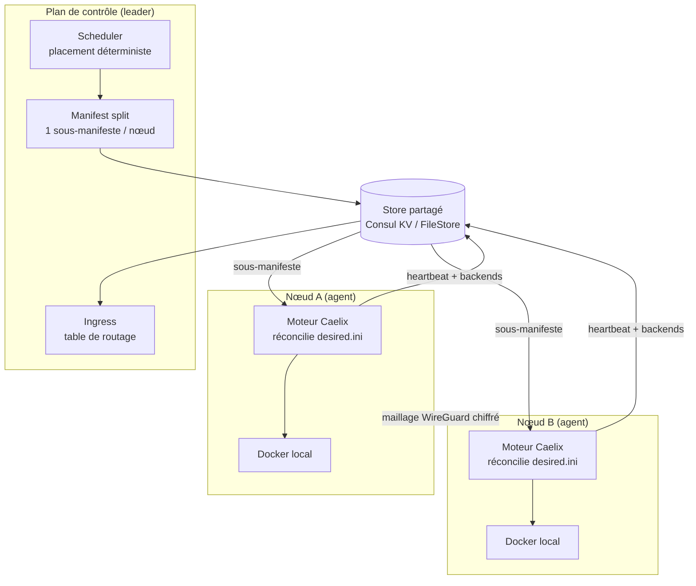

# Cluster multi-nœud (HA)

| | |
|---|---|
| **Disponibilité** | Optionnel — Caelix reste mono-hôte par défaut |
| **Activation** | Variable `CAELIX_CLUSTER_BACKEND` (`file` ou `consul`) |
| **Mise en place** | [Démarrage › Cluster](../getting-started/cluster.md) |
| **Décisions de conception** | [RFC multi-nœud](multi-node-rfc.md) |

Cette page décrit **le fonctionnement** du cluster Caelix : ses composants, le flux
de données et les mécanismes de haute disponibilité.

---

## 1. Vue d'ensemble

En cluster, Caelix suit un modèle **controller + agents**. Le moteur
auto-réparateur (`health`, `repair`, blue/green, autoscale) reste l'**exécuteur
local** de chaque nœud ; un **plan de contrôle** décide *quel nœud héberge quoi* et
*replanifie* en cas de panne. L'état partagé vit dans un **store** ; le trafic
inter-nœuds passe par un **maillage WireGuard chiffré**.

---

## 2. Rôles : agent et controller

| Rôle | Processus | Responsabilité |
|---|---|---|
| **Agent** | `caelix agent` (sur chaque nœud) | Réconcilie son sous-manifeste local, publie son identité, son heartbeat et ses backends, applique le maillage WireGuard. |
| **Controller** | backend FastAPI avec `CAELIX_CONTROLLER=1` | Lit l'état désiré + les nœuds vivants, planifie le placement, écrit un sous-manifeste par nœud. **Élu leader** : un seul controller agit à la fois. |

Un nœud peut tenir les deux rôles à la fois (controller co-localisé avec un agent).
Le déploiement typique : 3 nœuds, chacun agent, dont un leader.

---

## 3. Le store partagé

Tout l'état partagé transite par une **interface de store**
(`core/cluster/store.py`), avec deux implémentations choisies par
`CAELIX_CLUSTER_BACKEND` :

- **`FileStore`** (`file`) — un arbre de fichiers local. Sans dépendance,
  **mono-controller** : développement, tests, cluster « managé » à un controller.
- **`ConsulStore`** (`consul`) — Consul KV. Apporte le **consensus Raft**,
  l'**élection de leader** (sessions/locks), la *service-discovery* et les
  health-checks. C'est le backend de la **haute disponibilité**.

Scheduler, controller, ingress et liveness sont **agnostiques du backend** : ils ne
parlent qu'à l'interface du store.

Disposition des clés (RFC §9) :

| Clé | Contenu |
|---|---|
| `cluster/manifest.ini` | État désiré global (INI) |
| `nodes/<id>/meta` | Identité du nœud : adresse, labels, `docker_addr`, clé/endpoint WireGuard |
| `nodes/<id>/status` | Heartbeat + état observé publiés par l'agent |
| `nodes/<id>/desired.ini` | Sous-manifeste poussé par le controller |
| `backends/<app>/<node>` | Backends sains publiés pour l'ingress |

---

## 4. Placement et sous-manifestes

Le **scheduler** (`scheduler.py`) reçoit les specs de placement par application et
la liste des nœuds enregistrés, et décide quel nœud héberge chaque réplica. Il est :

- **déterministe** — même entrée → même sortie, stable entre les passes ;
- **contraint** — affinité de nœud, anti-affinité / `max_per_node` ; si les nœuds
  éligibles manquent, les réplicas passent en `pending` plutôt que d'échouer.

Le **manifest split** (`manifest_split.py`) transforme ce plan en **un
sous-manifeste INI par nœud**, dans la forme exacte que l'agent réconcilie déjà. Les
sections réservées (`orchestrator`, `proxy`, `notify`, `global`) sont propagées à
tous les nœuds ; chaque application est émise sous le nom de son instance placée,
sans les clés de placement propres au cluster.

L'agent pointe `CAELIX_MANIFEST` sur son `desired.ini` et lance `reconcile_all` :
il réconcilie son sous-manifeste **à l'identique du mode mono-hôte**.

---

## 5. Haute disponibilité

### 5.1 Élection de leader

La boucle controller (`loop.py`) tourne sur les nœuds de contrôle
(`CAELIX_CONTROLLER=1`). À chaque tick, elle **renouvelle sa session Consul** et
tente d'**acquérir le verrou de leadership**. Seul le leader replanifie ; les
followers sont en lecture seule. Avec `FileStore`, le controller unique est toujours
leader.

### 5.2 Heartbeat & liveness

Chaque agent renouvelle un **heartbeat** (horodatage UTC) dans le store à chaque
cycle. Un nœud est **vivant** tant que son heartbeat tient dans le TTL
(`CAELIX_NODE_TTL`, 30 s par défaut). Le controller ne planifie que sur les nœuds
vivants (`liveness.py`) : si un nœud cesse de battre, il est **exclu** et ses charges
*stateless* sont **replanifiées sur les survivants**.

### 5.3 Fencing par bail

Avant chaque passe, l'agent **renouvelle son bail** cluster. **Si le bail est perdu**
(store injoignable, partition réseau), l'agent **se clôture lui-même** (*self-fence*)
et **saute la réconciliation**. Principe « le bail fait autorité » : un nœud
partitionné mais encore vivant n'entre pas en conflit avec le replanning du leader.

---

## 6. Réseau : maillage WireGuard

Le trafic est-ouest passe par un **underlay WireGuard chiffré** (`mesh.py`), pas par
les ports de l'hôte :

- chaque nœud reçoit un **sous-réseau conteneur déterministe** `10.42.<n>.0/24` ;
- chaque nœud publie sa **clé publique** et son **endpoint** WireGuard dans sa meta
  (`wg_pubkey` / `wg_endpoint`) — **la clé privée ne quitte jamais le nœud** ;
- le `wg0.conf` d'un nœud est rendu à partir des metas de ses pairs.

L'application système (`wg` / `ip`) se fait par `caelix mesh-keygen` / `mesh-up` /
`mesh-down` (root requis).

---

## 7. Ingress

Les agents publient leurs **backends** (adresses des conteneurs sains) dans le store.
L'**ingress** (`ingress.py`) lit ce registre et produit la **table de routage**
cluster : pour chaque application, sa clé de route (`autoscale_route` ou le nom de
l'app) mappée vers la liste dédupliquée et triée de ses backends, tous nœuds
confondus. Le **proxy Caelix** est régénéré depuis cette table, ce qui réutilise
l'intégration certbot/domaines existante.

---

## 8. Volumes (stateful)

- **`pinned`** (défaut sûr) : le volume vit sur un nœud, l'app y est épinglée.
- **`shared`** : volume **NFSv4** dont le trafic passe sur le maillage WireGuard,
  utilisable depuis n'importe quel nœud.
- **Drain** : un nœud peut être *vidé* (rendu non-planifiable) pour maintenance ; ses
  charges sont replanifiées ailleurs.

---

## 9. Ciblage d'un nœud

En cluster, chaque opération adossée à Docker peut viser un nœud précis :

1. La console attache l'en-tête `X-Caelix-Node: <id>` aux appels concernés.
2. Le middleware `NodeTargetMiddleware` (`main.py`) résout l'endpoint Docker du nœud
   (`docker_addr`, publié dans sa meta) et le place dans une `ContextVar` pour la
   durée de la requête.
3. `docker_target_env` (`core/docker.py`) privilégie cette contextvar sur
   `CAELIX_DOCKER_HOST` et positionne `DOCKER_HOST` / `CONTAINER_HOST`. Comme **toute**
   opération Docker passe par `run_cmd`, conteneurs, images, volumes, réseaux, stacks,
   logs, métriques et déploiements visent le bon démon.
4. Les caches d'état (`core/state.py`) sont **indexés par nœud ciblé** (`""` = local),
   pour qu'une vue ne mélange pas les données de deux nœuds.

Les endpoints **non-Docker** (métriques système du process controller, sauvegarde
locale) restent **controller-local** : ils décrivent le controller, pas un démon
distant. Les métriques par nœud proviennent du statut cluster et du heartbeat.

---

## 10. Carte des modules

| Composant | Module | Rôle |
|---|---|---|
| Cible Docker | `core/docker.py` | `docker_target_env` / `run_cmd` — routage vers le démon visé |
| Identité & cycle agent | `lib/node.sh`, `bin/caelix` | meta/status, heartbeat, bail, backends, mesh |
| Store | `store.py`, `consul_store.py`, `factory.py` | FileStore / ConsulStore + sélection |
| Placement | `scheduler.py` | Placement déterministe et contraint |
| Sous-manifestes | `manifest_split.py` | Découpe l'état désiré par nœud |
| Réconciliation contrôle | `controller.py`, `loop.py` | Passe controller + boucle leader |
| Liveness | `liveness.py` | Heartbeat / nœuds vivants / replanning |
| Réseau | `mesh.py` | Sous-réseaux et configuration WireGuard |
| Ingress | `ingress.py` | Table de routage cluster |
| Ciblage de nœud | `main.py`, `core/state.py` | Middleware `X-Caelix-Node` + caches par nœud |

---

## 11. Sécurité

- **mTLS** sur le plan de contrôle, **ACL Consul** par nœud.
- **Bail = autorité** (fencing) : un nœud sans bail ne réconcilie pas.
- **Clés privées WireGuard** : générées sur le nœud, **jamais transmises**.
- Endpoint Docker distant : en production, le **restreindre au sous-réseau WireGuard
  + mTLS** (le banc de test l'expose en TCP clair sur un réseau isolé).
