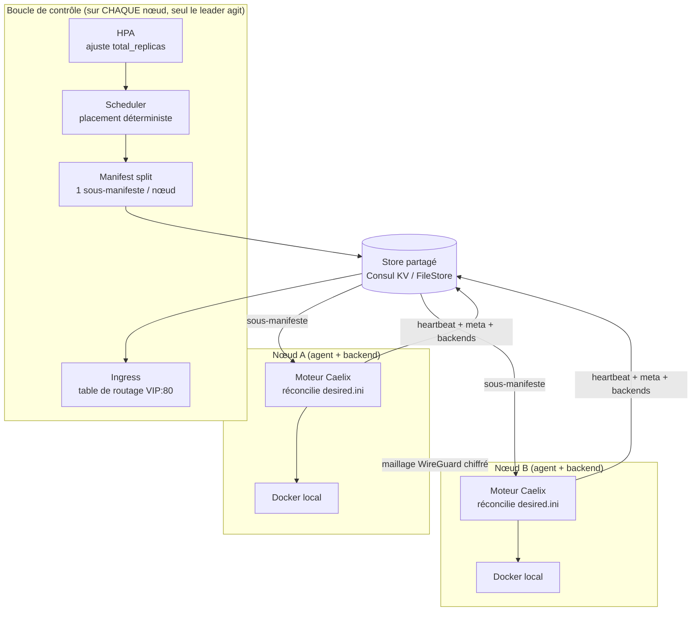

# Cluster multi-nœud (HA) — Caelix 2.0

| | |
|---|---|
| Disponibilité | Optionnel ; Caelix reste mono-hôte par défaut |
| Activation | Variable `CAELIX_CLUSTER_BACKEND` (`file` ou `consul`) |
| Mise en place | [Démarrage › Cluster](../getting-started/cluster.md) |
| Décisions de conception | [RFC multi-nœud](multi-node-rfc.md) |

Cette page décrit le fonctionnement du cluster Caelix 2.0 : le plan de contrôle,
le store partagé, le placement, le cycle d'agent, la VIP flottante, le failover, l'ingress,
l'autoscaler horizontal (HPA), l'état console partagé, le ciblage Docker par nœud et le
maillage WireGuard.

---

## 1. Vue d'ensemble

En cluster, Caelix suit un modèle plan de contrôle + agents. Le moteur
auto-réparateur (`health`, `repair`, blue/green, autoscale) reste l'exécuteur
local de chaque nœud : il réconcilie un manifeste INI exactement comme en
mono-hôte, sans « savoir » qu'il est clusterisé. Au-dessus, un plan de contrôle
verrouillé par leader décide quel nœud héberge quoi, replanifie en cas de panne,
ajuste le nombre de répliques (HPA) et publie la table de routage de l'ingress.

L'état partagé vit dans un store (Consul KV en production). Une VIP flottante
suit le leader pour offrir un point d'accès stable, et le trafic est-ouest passe par un
maillage WireGuard chiffré obligatoire.

Point clé de la 2.0 : chaque nœud exécute le backend FastAPI avec la même boucle de
contrôle, et le leadership (verrou de session Consul) désigne le seul nœud qui agit.
Aucun nœud n'a de rôle figé ; un survivant promu reprend tout, du placement à la VIP et
à l'ingress.

---

## 2. Le plan de contrôle verrouillé par leader

Tous les nœuds lancent le backend FastAPI, donc tous lancent la boucle de contrôle
(`core/cluster/loop.py` : `controller_loop` → `controller_tick`). Le leadership est
un verrou de session Consul (`ConsulStore.acquire_leadership`) et seul le leader agit.
Avec le `FileStore` (un controller unique), ce controller est toujours leader.

À chaque tick, le leader exécute, dans l'ordre :

1. `hpa_tick` : ajuste `total_replicas` des services autoscalés depuis la métrique
   CPU vivante (§8), avant la planification, pour que la même passe place le nouveau compte ;
2. `apply_cluster` : lit le manifeste cluster et les nœuds vivants, planifie le
   placement et écrit un sous-manifeste par nœud dans le store (§4) ;
3. `publish_mesh` : rend et publie les directives WireGuard (sans secret) par nœud (§9).

La boucle renouvelle sa session Consul à chaque itération (intervalle
`CAELIX_CONTROLLER_INTERVAL`, 10 s par défaut ; TTL de session ≥ `CAELIX_NODE_TTL`). Une
défaillance HPA est attrapée et n'interrompt jamais le plan de contrôle.

| Rôle | Processus | Responsabilité |
|---|---|---|
| Agent | `lib/node.sh` (sur l'hôte de chaque nœud) | Renouvelle son bail Consul, synchronise son sous-manifeste, le réconcilie avec le moteur normal, publie sa meta et ses backends, applique le maillage WireGuard et réconcilie la VIP. |
| Boucle de contrôle | backend FastAPI (sur chaque nœud) | Verrouillée par leader : HPA → placement → mesh. Un seul leader agit. |

Un nœud tient les deux à la fois (backend co-localisé avec l'agent). Le déploiement typique
compte 3 nœuds, chacun agent et backend, avec 3 serveurs Consul pour le quorum.

---

## 3. Le store partagé

Tout l'état partagé transite par une interface de store, avec deux implémentations
choisies par `CAELIX_CLUSTER_BACKEND` :

- `FileStore` (`file`) : un arbre de fichiers local. Sans dépendance et
  mono-controller, il couvre le développement, les tests et un cluster « managé » à un
  seul controller.
- `ConsulStore` (`consul`) : Consul KV via son API HTTP (stdlib `urllib`, aucune
  dépendance ajoutée). Il apporte le consensus Raft et l'élection de leader
  (sessions/locks), et c'est le backend de la haute disponibilité.

Scheduler, controller, ingress, HPA et liveness sont agnostiques du backend : ils ne
parlent qu'à l'interface du store.

Le store détient (préfixe `caelix/`) :

| Clé | Contenu |
|---|---|
| `cluster/manifest` | État désiré global du cluster (JSON) |
| `nodes/<id>/meta` | Identité du nœud : `addr`, labels, `docker_addr`, `wg_pubkey`/`wg_endpoint`, ressources |
| `nodes/<id>/heartbeat` | Bail/heartbeat (horodatage UTC) publié par l'agent |
| `nodes/<id>/desired` | Sous-manifeste INI poussé par le leader |
| `nodes/<id>/mesh` | Directives WireGuard (sans secret) rendues par le leader |
| `nodes/<id>/drain` | Drapeau de mise en drain |
| `services/<app>/backends/<inst>` | Registre des backends `<node_addr>:<port_hôte>` publiés par les agents |
| `cluster/leader` | Verrou de leadership (session + `node_id`) |
| `cluster/vip` | VIP flottante publiée par le leader |
| `console/...` | État console partagé (utilisateurs, secret JWT, config, templates, stacks, certs) ; voir §7 |

---

## 4. Placement et découpe du manifeste

`apply_cluster` (`controller.py`) lit le manifeste cluster et les nœuds vivants, puis
appelle le scheduler et le manifest split.

Le scheduler (`scheduler.py`) place le `total_replicas` de chaque app sur les nœuds.
Il est déterministe et contraint :

- déterministe : même entrée, même sortie, stable entre les passes ; ordre par nom
  d'app, puis nœuds triés par id ;
- contraint : il respecte `node_affinity`, l'anti-affinité et `max_per_node`, et il
  équilibre la charge (moins de répliques de l'app, puis charge globale la plus faible).
  Si les nœuds éligibles manquent, les répliques excédentaires passent en `pending`
  plutôt que d'échouer. La première réplique d'une app sur un nœud garde le nom nu de
  l'app ; les suivantes reçoivent un suffixe `-rN`.

Le manifest split (`manifest_split.py`) rend un sous-manifeste INI par nœud, dans
la forme exacte que l'agent réconcilie déjà :

- les clés de placement (`total_replicas`, `hpa_*`, affinités, `max_per_node`…) sont
  retirées de la section par-nœud, et l'agent ne voit qu'un service simple ;
- une section sans `health_type` reçoit `health_type = none` injecté, pour qu'un
  service cluster nu (par exemple `image = nginx` déployé depuis la console) ne soit pas
  réparé à mort. Le conteneur est sain tant qu'il tourne, et l'ingress santé-checke
  indépendamment chaque backend ; un `health_type` explicite l'emporte toujours ;
- les sections réservées (`orchestrator`, `proxy`, `notify`, `global`) sont propagées
  verbatim à tous les nœuds.

L'agent pointe `CAELIX_MANIFEST` sur son `desired.ini` et lance `reconcile_all` : il
réconcilie son sous-manifeste à l'identique du mode mono-hôte.

---

## 5. Le cycle d'agent (`lib/node.sh`)

L'agent tourne sur l'hôte de chaque nœud, en tête de chaque passe (`node_agent_cycle`) :

1. Renouvellement du bail (`node_lease_renew`) : écrit son heartbeat dans le store.
   En cas d'échec (store injoignable, partition), l'agent se clôture lui-même
   (*self-fence*, `node_fence_set`). Il suspend ses créations et réparations pour ne pas
   double-démarrer des charges que le leader replanifie ailleurs, et relâche la VIP.
   Il se dé-fence dès que le bail revient.
2. Synchronisation (`node_cluster_sync`) : génère ses clés WireGuard (idempotent),
   publie sa meta, adopte son sous-manifeste poussé par le leader, le réconcilie,
   puis publie ses backends dans le registre.
3. Maillage (`node_mesh_ensure`) : applique les directives WireGuard (§9).
4. VIP (`node_vip_reconcile`) : leader → pose la VIP ; non-leader → la relâche (§6).

### Publication des backends

Pour chaque section du sous-manifeste qui tourne, l'agent parse la ligne `publish`
(`[ip:]hôte:conteneur`) pour en extraire le port hôte, et publie un backend
`<CAELIX_NODE_ADDR>:<port_hôte>` sous `services/<app>/backends/<node>-<app>`. Quand le
conteneur n'est pas en marche, le backend est dépublié. Le leader/ingress lit ce registre
pour router vers les répliques de n'importe quel nœud.

---

## 6. VIP flottante

La VIP (`CAELIX_CLUSTER_VIP`, par exemple `10.0.0.10/32`) est une adresse stable qui suit le
leader :

- l'agent du leader ajoute la VIP à son interface (`CAELIX_VIP_IFACE`, sinon
  l'interface de la route par défaut) et envoie un ARP gratuit pour rafraîchir la
  table L2 des voisins (`node_vip_bind`) ;
- les non-leaders la relâchent (`node_vip_release`) ; sur perte de bail, le nœud la
  relâche aussi, pour qu'un nœud sain la reprenne.

La console (`:18100`) et l'ingress (`:80`) écoutent en `0.0.0.0`, donc répondent sur la
VIP : c'est un point d'accès stable au cluster, indépendant de l'IP du nœud courant. La
VIP est publiée dans le store (`cluster/vip`) pour qu'un nœud promu leader la reprenne
sans reconfiguration.

---

## 7. Failover et fencing

- Quorum : avec ≥ 3 serveurs Consul, le quorum Raft 2/3 survit à la perte d'un
  nœud. Le verrou de leadership (`cluster/leader`, session `Behavior=delete`) est
  automatiquement libéré quand la session du leader expire (crash, partition) ; un
  survivant l'acquiert et son agent pose la VIP. Le quorum Consul garantit un leader
  unique, donc pas de split-brain.
- Liveness : le leader ne planifie que sur les nœuds vivants, c'est-à-dire dont le
  heartbeat tient dans le TTL `CAELIX_NODE_TTL` (30 s par défaut, `liveness.py`). Un nœud
  qui cesse de battre est exclu, et ses charges *stateless* sont replanifiées sur les
  survivants. Un nœud en drain est aussi exclu : ses charges movibles partent, mais une
  app `pinned` y reste en `pending`, ce qui bloque la complétion du drain.
- Fencing par bail : un nœud qui perd son bail cesse d'agir comme leader et relâche la
  VIP. Le bail fait autorité, donc un nœud partitionné mais vivant n'entre pas en conflit
  avec le replanning.

---

## 8. Ingress global

Le leader exécute un proxy inverse socat global sur `VIP:80`
(`lib/autoscale_proxy.sh` : `global_proxy_ensure`). Il construit ses routes depuis le
registre de services : chaque app dotée d'une clé `autoscale_route` donne une route dont
les backends sont les `<node_addr>:<port_hôte>` publiés par tous les nœuds hébergeant
une réplique.

- `routes.conf` est régénéré à chaque passe de réconciliation ; le handler socat le
  relit à chaque connexion, donc un changement de route ou de backend prend effet
  sans redémarrage.
- Le hash de config ne couvre que le listener (`listen` / TLS) et ne gouverne que
  son redémarrage. L'ajout d'un service cluster ne nécessite donc jamais de relancer le
  proxy (un hash circulaire causait jadis des 502).
- Côté API, `build_routes` (`ingress.py`) expose la même table via
  `GET /api/cluster/routes` (clé de route → adresses de backends, dédupliquées et
  triées, tous nœuds confondus).
- Les backends morts sont éliminés par le health-check du proxy avant routage.

---

## 9. Autoscaler horizontal (HPA)

Pour chaque service `hpa = 1`, le leader (`hpa.py`) :

1. lit le CPU de chaque réplique via `docker stats` ciblant le `docker_addr` du nœud
   qui l'héberge (le même endpoint que `X-Caelix-Node`), et moyenne les échantillons ;
2. déplace `total_replicas` de ±1 vers `hpa_target` (cible CPU %, 60 par défaut), borné
   par `[hpa_min, hpa_max]`, après `hpa_cooldown` ticks consécutifs over/under ;
3. applique une hystérésis asymétrique : scale up quand la moyenne dépasse la cible,
   scale down seulement quand la moyenne tombe sous cible × 0,5 (ce qui évite le flapping).

Le scheduler place ensuite le nouveau compte et l'ingress load-balance, exactement comme
si on changeait `total_replicas` à la main, mais automatiquement. Les compteurs de cooldown
sont en-process ; une remise à zéro au failover est inoffensive, l'HPA réévaluant depuis
la métrique vivante.

---

## 10. État console partagé

`ui/backend/app/core/shared_state.py` est une abstraction Consul-KV (préfixe
`caelix/console/`), active en mode cluster (`CAELIX_CLUSTER_BACKEND=consul`), inerte en
mono-hôte. Comme chaque nœud exécute la console, l'état géré par la console doit être
cohérent entre les nœuds et survivre au failover :

- utilisateurs, secret JWT, config mono-fichier, templates, stacks Compose et `.env`,
  certificats TLS.

Le contenu lié au disque (fichiers Compose, PEM) est matérialisé sur le disque local
(`materialize_dir`) avant que l'outil disque (`docker compose`, le proxy) ne l'utilise. Sans
ce partage, un failover de VIP poserait l'opérateur sur un autre nœud avec un mot de passe
différent, des sessions invalidées et une config divergente.

---

## 11. Ciblage Docker par nœud

En cluster, chaque opération adossée à Docker peut viser un nœud précis :

1. La console attache l'en-tête `X-Caelix-Node: <id>` aux appels concernés.
2. Le backend résout le `docker_addr` de ce nœud (valide `tcp://hôte:port` ou
   `unix://`, publié dans sa meta) et exécute la commande Docker contre ce démon.
3. `dockerd` est exposé en TCP sur l'IP privée du nœud (`tcp://<ip>:2375`, posé par
   `node_write_cluster_env`) ; en production, le restreindre au sous-réseau WireGuard
   avec mTLS.

Conteneurs, images, volumes, réseaux, stacks, logs et métriques visent ainsi le bon démon.
Le HPA réutilise ce même `docker_addr` pour lire le CPU des répliques.

---

## 12. Maillage WireGuard

Le trafic est-ouest passe par un underlay WireGuard chiffré obligatoire, pas par les
ports de l'hôte :

- chaque nœud génère sa paire de clés localement (`node_mesh_keygen`) ; la clé privée
  ne quitte jamais le nœud, et seuls `wg_pubkey` et `wg_endpoint` partent dans la meta ;
- le leader rend les directives de mesh (sans secret) par nœud et les publie
  (`publish_mesh`) ;
- l'agent applique les directives à chaque cycle (`node_mesh_ensure`), de façon
  idempotente (hash) : il ne ré-applique que si elles changent ou si l'interface a
  disparu (par exemple après un redémarrage de l'hôte), pour que le maillage survive aux
  reboots.

L'application système (`wg` / `ip`) requiert root ; `wg` est obligatoire sur un nœud
cluster (l'install l'exige).

---

## 13. Carte des modules

| Composant | Module | Rôle |
|---|---|---|
| Boucle de contrôle | `cluster/loop.py` | Verrou de leader + tick (HPA → placement → mesh) |
| Action controller | `cluster/controller.py` | `apply_cluster`, `publish_mesh`, drain |
| Store | `cluster/consul_store.py`, `cluster/store.py` (FileStore), `factory.py` | KV Consul / fichier + sélection |
| Placement | `cluster/scheduler.py` | Placement déterministe et contraint |
| Découpe | `cluster/manifest_split.py` | Sous-manifeste INI par nœud |
| Liveness | `cluster/liveness.py` | Heartbeat / nœuds vivants |
| HPA | `cluster/hpa.py` | Autoscaler horizontal piloté CPU |
| Ingress (table) | `cluster/ingress.py` | `build_routes` → `GET /api/cluster/routes` |
| Ingress (proxy) | `lib/autoscale_proxy.sh` | Proxy global socat sur `VIP:80` |
| Maillage | `cluster/mesh.py`, `lib/node.sh` | Directives WireGuard + application |
| État console partagé | `core/shared_state.py` | Consul-KV `caelix/console/` |
| Agent | `lib/node.sh` | Bail, sync, backends, mesh, VIP, fencing |

---

## 14. Sécurité

- mTLS sur le plan de contrôle, ACL Consul par nœud (token `CAELIX_CONSUL_TOKEN`).
- Bail = autorité (fencing) : un nœud sans bail ne réconcilie pas et relâche la VIP.
- Clés privées WireGuard : générées sur le nœud, jamais transmises.
- Quorum Consul : verrou de session `Behavior=delete`, donc un seul leader et pas de
  split-brain.
- Endpoint Docker distant : en production, le restreindre au sous-réseau WireGuard avec
  mTLS (le banc de test l'expose en TCP clair sur un réseau isolé).
