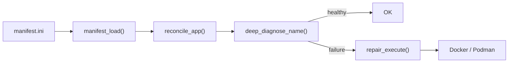
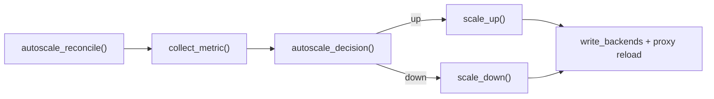
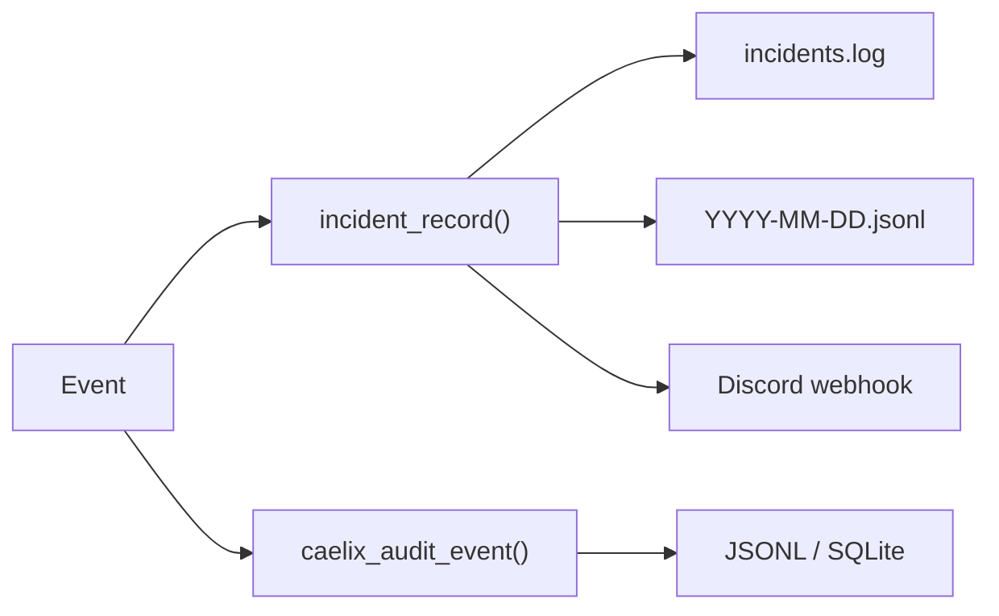
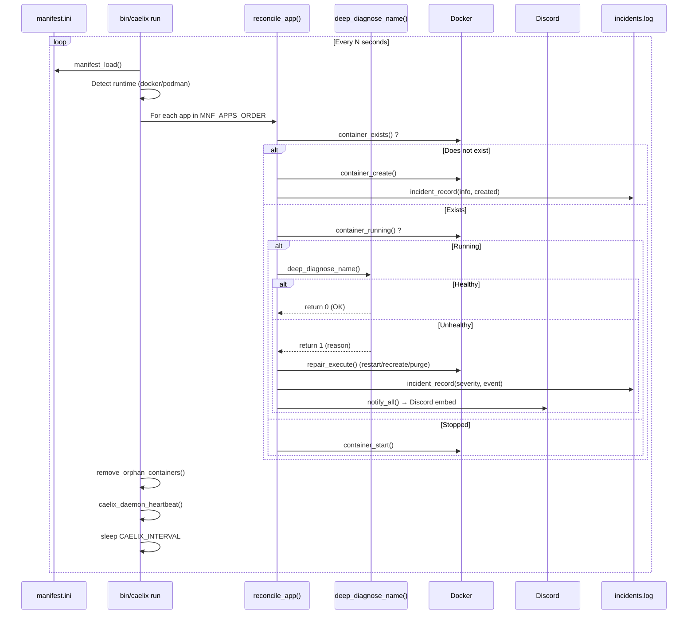
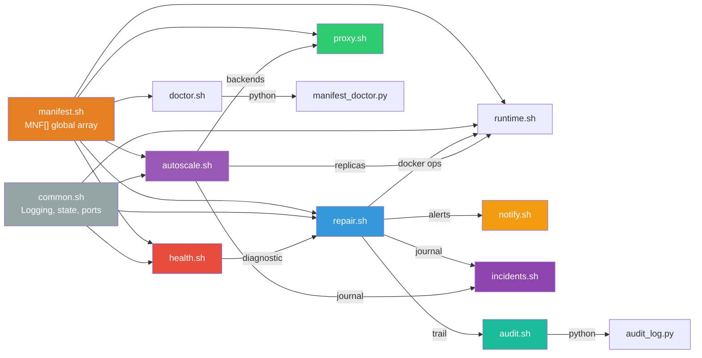

# Architecture Overview

## Design Principles

| Principle | Description |
|---|---|
| **Single-node** | No multi-machine coordination. Designed to orchestrate containers on a single host. |
| **Declarative** | The desired state is defined in an INI file. The engine converges toward that state on each cycle. |
| **Self-healing** | Automatic repair through escalation (restart → recreate → purge) without intervention. |
| **Minimal** | Dependencies: Bash 5, curl, Docker or Podman. No additional runtime required. |
| **Observable** | Audit trail, incident journal, Discord alerts, Prometheus metrics. |

---

## Components

### Reconciliation Pipeline

### Autoscale Pipeline

### Observability

---

## Main Data Flow

---

## Inter-Module Communication

---

## Naming Conventions

### Containers

| Type | Format | Example |
|---|---|---|
| Standard service | `caelix-<app>` | `caelix-web` |
| Blue/green candidate | `caelix-<app>-candidate-<timestamp>` | `caelix-web-candidate-1705312200` |
| Autoscale replica | `caelix-<app>-r<N>` | `caelix-web-r3` |
| Load balancer (legacy) | `caelix-<app>-lb` | `caelix-web-lb` |

### Docker Labels

| Label | Value | Usage |
|---|---|---|
| `caelix.app` | Service name | Identification |
| `caelix.config_version` | Config version | Change detection |
| `caelix.role` | `replica` | Autoscale replica distinction |
| `caelix.replica` | Number (1, 2, 3...) | Replica index |

### State Files

| Pattern | Example | Content |
|---|---|---|
| `.caelix/state/<app>.fail` | `.caelix/state/web.fail` | Failure counter (integer) |
| `.caelix/state/<app>.manual_pause` | `.caelix/state/web.manual_pause` | Pause reason |
| `.caelix/state/<app>.suspend_reconcile` | `.caelix/state/web.suspend_reconcile` | Suspension flag |
| `.caelix/state/<app>.create_fail_streak` | `.caelix/state/web.create_fail_streak` | Consecutive failures |
| `.caelix/state/<app>.restart_count` | `.caelix/state/web.restart_count` | Last Docker restart count |
| `.caelix/state/<app>.http_errrate` | `.caelix/state/web.http_errrate` | `fail total` (sliding window) |
| `.caelix/state/<app>.autoscale_cooldown` | `.caelix/state/web.autoscale_cooldown` | Decision streak |
| `.caelix/autoscale/<app>.backends` | `.caelix/autoscale/web.backends` | `name host port` per line |
