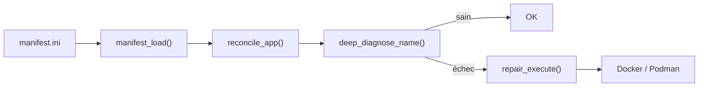
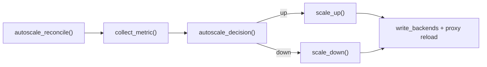
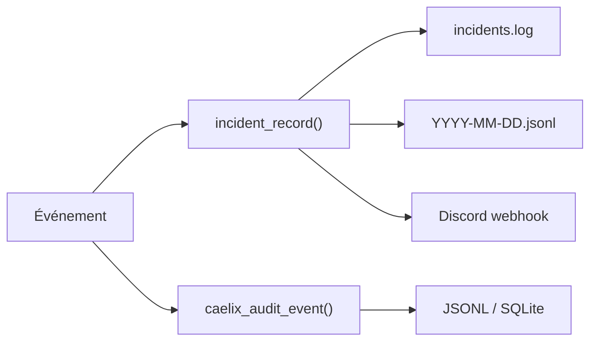
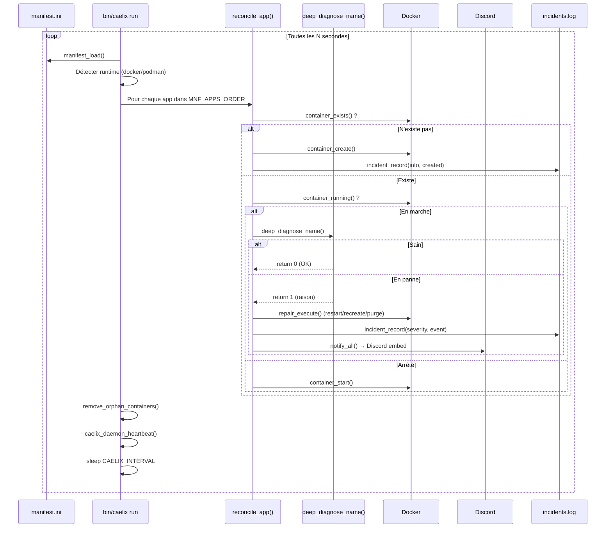
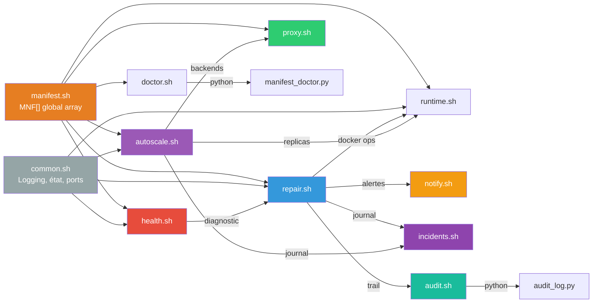

# Vue d'ensemble de l'architecture

## Principes de conception

| Principe | Description |
|---|---|
| **Single-node** | Pas de coordination multi-machines. Conçu pour orchestrer des conteneurs sur un seul hôte. |
| **Déclaratif** | L'état désiré est défini dans un fichier INI. Le moteur converge vers cet état à chaque cycle. |
| **Self-healing** | Réparation automatique par escalade (restart → recreate → purge) sans intervention. |
| **Minimal** | Dépendances : Bash 5, curl, Docker ou Podman. Pas de runtime additionnel requis. |
| **Observable** | Audit trail, journal d'incidents, alertes Discord, métriques Prometheus. |

---

## Composants

### Pipeline de réconciliation

### Pipeline autoscale

### Observabilité

---

## Flux de données principal

---

## Communication entre modules

---

## Conventions de nommage

### Conteneurs

| Type | Format | Exemple |
|---|---|---|
| Service standard | `caelix-<app>` | `caelix-web` |
| Candidat blue/green | `caelix-<app>-candidate-<timestamp>` | `caelix-web-candidate-1705312200` |
| Replica autoscale | `caelix-<app>-r<N>` | `caelix-web-r3` |
| Load balancer (legacy) | `caelix-<app>-lb` | `caelix-web-lb` |

### Labels Docker

| Label | Valeur | Usage |
|---|---|---|
| `caelix.app` | Nom du service | Identification |
| `caelix.config_version` | Version de config | Détection de changement |
| `caelix.role` | `replica` | Distinction replicas autoscale |
| `caelix.replica` | Numéro (1, 2, 3...) | Index de la replica |

### Fichiers d'état

| Pattern | Exemple | Contenu |
|---|---|---|
| `.caelix/state/<app>.fail` | `.caelix/state/web.fail` | Compteur d'échecs (entier) |
| `.caelix/state/<app>.manual_pause` | `.caelix/state/web.manual_pause` | Raison de la pause |
| `.caelix/state/<app>.suspend_reconcile` | `.caelix/state/web.suspend_reconcile` | Flag de suspension |
| `.caelix/state/<app>.create_fail_streak` | `.caelix/state/web.create_fail_streak` | Échecs consécutifs |
| `.caelix/state/<app>.restart_count` | `.caelix/state/web.restart_count` | Dernier restart count Docker |
| `.caelix/state/<app>.http_errrate` | `.caelix/state/web.http_errrate` | `fail total` (fenêtre glissante) |
| `.caelix/state/<app>.autoscale_cooldown` | `.caelix/state/web.autoscale_cooldown` | Streak de décisions |
| `.caelix/autoscale/<app>.backends` | `.caelix/autoscale/web.backends` | `name host port` par ligne |
