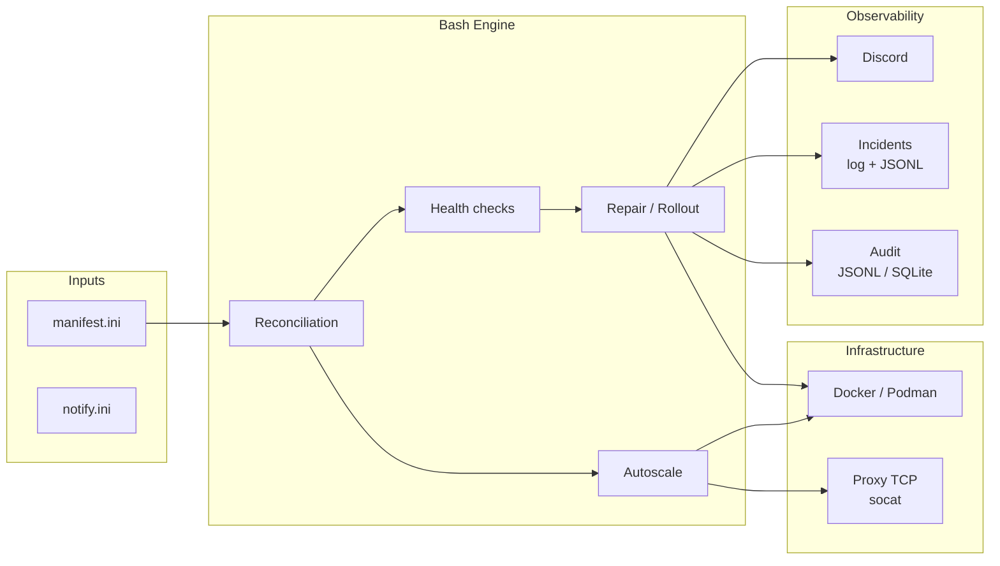

# Caelix — Self-healing Docker orchestration

<p align="center">
  
</p>

<p align="center"><strong>Self-healing Docker orchestrator — single host or HA cluster</strong></p>

---

## Overview

Caelix is a declarative orchestrator for Docker containers. Services are defined in an INI file. The engine ensures convergence toward the desired state through a continuous reconciliation loop. It runs **single-host** by default, and **as a high-availability cluster** optionally — a cluster that is **HA by design** and managed **like a single host** from the console: every node is a Consul server + controller, a **floating VIP** gives one stable address that **fails over automatically**, console state is shared, and you drive **any node's Docker** from the UI.

**Key capabilities:**

- Declarative reconciliation with drift detection
- Health checks: HTTP, TCP, memory, OOM, latency, error rate, logs, disk
- Automatic repair through escalation (restart → recreate → purge)
- Blue/green deployment with pre-switch validation
- Horizontal autoscaling with built-in TCP load balancer (socat)
- **HA cluster (2.0)**: Consul control plane (Raft quorum), **floating VIP** with **automatic failover**, mandatory WireGuard mesh, **shared console state** (users, JWT secret, config, templates, Compose stacks, TLS certs), **per-node Docker** (`X-Caelix-Node`), and horizontal **HPA** on CPU
- Discord alerts with detailed diagnostics
- Audit trail in JSONL or SQLite
- Web console: Vue 3 + FastAPI (~189 REST operations, httpOnly cookie auth)

---

## Architecture



---

## Tech Stack

| Component | Technology |
|---|---|
| Engine | Bash 5, curl, Docker/Podman |
| Proxy | socat (TCP round-robin, hot-reload) |
| UI Backend | Python 3.11+, FastAPI, SSE |
| UI Frontend | Vue 3, TypeScript, Tailwind CSS, Vite |
| Notifications | Discord webhooks |
| Audit | JSONL or SQLite |

---

## Project Structure

```
caelix/
├── bin/caelix                    # CLI (9 commands)
├── lib/                        # Bash engine
│   ├── common.sh               #   Logging, state management, port allocation
│   ├── manifest.sh             #   INI parser
│   ├── runtime.sh              #   Docker/Podman abstraction
│   ├── health.sh               #   8 types of health checks
│   ├── repair.sh               #   Repair escalation, blue/green
│   ├── autoscale.sh            #   Replica management, metrics, decisions
│   ├── proxy.sh                #   TCP reverse proxy
│   ├── notify.sh               #   Discord notifications
│   ├── incidents.sh            #   Incident journal
│   ├── audit.sh                #   Bash audit hook
│   ├── doctor.sh               #   Validation and diagnostics
│   ├── audit_log.py            #   JSONL/SQLite persistence
│   └── manifest_doctor.py      #   Advanced Python validation
├── etc/                        # Configuration
│   ├── manifest.ini            #   Declared services
│   └── notify.ini              #   Discord webhook
├── ui/                         # Web console
│   ├── backend/                #   FastAPI (~27 routers, ~189 operations)
│   ├── frontend/               #   Vue 3 SPA
│   └── Dockerfile              #   Multi-stage build
├── scripts/                    # Installation and maintenance
├── .caelix/                      # Runtime data
├── caelix.global.service         # systemd unit
└── VERSION                     # 2.0.0-beta.1
```

---

## Quickstart

=== "Automatic installation"

    ```bash
    git clone https://github.com/Arcneell/Caelix.git
    cd Caelix
    ./scripts/install-all.sh
    ```

=== "Manual installation"

    ```bash
    git clone https://github.com/Arcneell/Caelix.git
    cd Caelix
    cp etc/manifest.ini.example etc/manifest.ini
    cp etc/notify.ini.example etc/notify.ini
    bin/caelix validate
    bin/caelix run
    ```

=== "HA cluster (2.0, opt-in)"

    Pull the beta channel (`:2.0.0-beta.1` or `:beta`); bootstrap one controller with a floating VIP, then join the other nodes:

    ```bash
    INSTALL="ghcr.io/arcneell/caelix:2.0.0-beta.1"

    # Controller node — bootstraps Consul + owns the VIP
    docker run --rm $INSTALL cat /opt/caelix/install.sh | bash -s -- \
      --with-systemd --mode controller --vip 10.0.0.10/32 --admin-password 'SAME_ON_ALL_NODES'

    # Join nodes — point them at an existing controller's Consul API
    docker run --rm $INSTALL cat /opt/caelix/install.sh | bash -s -- \
      --with-systemd --mode join --consul-addr http://10.0.0.11:8500 --admin-password 'SAME_ON_ALL_NODES'
    ```

    The console and ingress then answer on the VIP (`http://10.0.0.10:18100`), which follows the leader on failover (`caelix vip-status`).

:material-arrow-right: [Full installation guide](getting-started/installation.md)

---

## Table of Contents

| Section | Content |
|---|---|
| [Getting Started](getting-started/installation.md) | Installation, first launch, documentation deployment |
| [Architecture](architecture/overview.md) | Components, reconciliation flow, state directory |
| [Cluster](architecture/cluster.md) | HA cluster: Consul control plane, floating VIP, shared state, HPA |
| [Configuration](configuration/manifest.md) | INI manifest, Discord notifications, environment variables |
| [Modules](modules/health.md) | Health, repair, autoscale, proxy, audit, incidents, notifications |
| [Web Console](ui/overview.md) | UI, REST API, frontend |
| [Reference](reference/cli.md) | CLI, exhaustive configuration, internal functions, troubleshooting |
