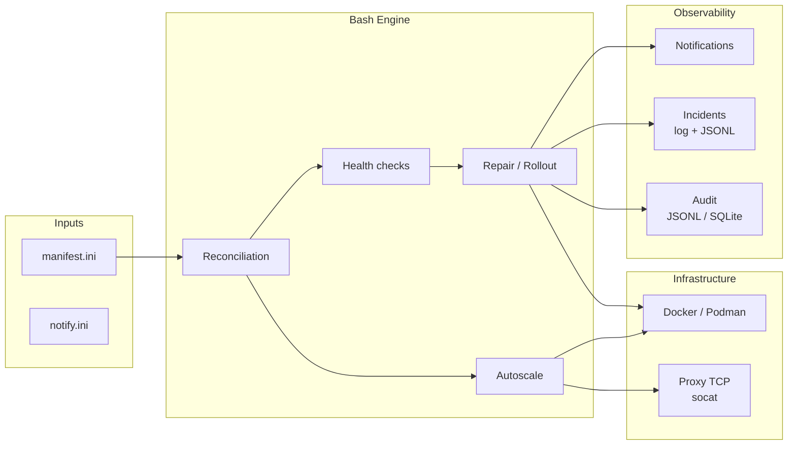

# Caelix

<p align="center">
  
</p>

<p align="center">Self-healing Docker orchestration for a single host or a high-availability cluster.</p>

---

## Overview

Caelix is a declarative container orchestrator. Services are described in an INI
file; a continuous reconciliation loop compares that declared state against what
Docker is actually running and corrects the difference. Caelix runs on a single
host by default and, optionally, as a high-availability cluster operated from the
console as though it were one host: every node is an etcd member and a controller,
a floating VIP provides a stable address that fails over automatically, console
state is replicated across the nodes, and one interface drives the Docker daemon of
any node.

Key capabilities:

- Declarative reconciliation with drift detection.
- Health checks: HTTP, TCP, memory, OOM, latency, error rate, logs, disk.
- Automatic repair by escalation (restart, recreate, purge).
- Blue/green deployment with validation before the cutover.
- Horizontal autoscaling behind a built-in TCP load balancer (socat).
- HA cluster: etcd control plane (Raft quorum), floating VIP with automatic
  failover, WireGuard mesh, shared console state (users, JWT secret, configuration,
  templates, Compose stacks, TLS certificates), per-node Docker (`X-Caelix-Node`),
  and CPU-based autoscaling.
- Multi-channel notifications (Discord, Slack, Teams, Telegram, SMTP).
- Audit trail in JSONL or SQLite.
- Vue 3 web console and FastAPI backend (about 189 REST operations, `httpOnly`
  cookie authentication).

---

## Architecture



---

## Tech stack

| Component | Technology |
|---|---|
| Engine | Bash 5, curl, Docker/Podman |
| Proxy | socat (TCP round-robin, hot reload) |
| Console backend | Python 3.11+, FastAPI, SSE |
| Console frontend | Vue 3, TypeScript, Tailwind CSS, Vite |
| Cluster control | etcd (KV, lease + put-if-absent transaction), WireGuard |
| Notifications | Discord, Slack, Teams, Telegram, SMTP |
| Audit | JSONL or SQLite |

---

## Project structure

```
caelix/
├── bin/caelix                  # CLI
├── lib/                        # Bash engine
│   ├── common.sh               #   Logging, state management, port allocation
│   ├── manifest.sh             #   INI parser
│   ├── runtime.sh              #   Docker/Podman abstraction
│   ├── health.sh               #   Health checks
│   ├── repair.sh               #   Repair escalation, blue/green
│   ├── autoscale.sh            #   Replicas, metrics, decisions
│   ├── proxy.sh                #   TCP reverse proxy
│   ├── notify.sh               #   Notifications
│   ├── incidents.sh            #   Incident journal
│   ├── node.sh                 #   Cluster agent (VIP, mesh, registry)
│   ├── doctor.sh               #   Validation and diagnostics
│   ├── audit_log.py            #   JSONL/SQLite persistence
│   └── manifest_doctor.py      #   Advanced validation
├── etc/                        # Configuration (manifest.ini, notify.ini)
├── ui/
│   ├── backend/                #   FastAPI (~27 routers, ~189 operations)
│   ├── frontend/               #   Vue 3
│   └── Dockerfile              #   Multi-stage build
├── scripts/                    # Installation and maintenance
├── .caelix/                    # Runtime data
└── VERSION                     # 2.1.3
```

---

## Quickstart

=== "Image (recommended)"

    ```bash
    echo "YOUR_TOKEN" | docker login ghcr.io -u Arcneell --password-stdin
    docker run --rm ghcr.io/arcneell/caelix:latest cat /opt/caelix/install.sh | bash -s -- --with-systemd
    ```

=== "From source"

    ```bash
    git clone https://github.com/Arcneell/Caelix.git
    cd Caelix
    cp etc/manifest.ini.example etc/manifest.ini
    cp etc/notify.ini.example etc/notify.ini
    bin/caelix validate
    bin/caelix run
    ```

=== "HA cluster"

    Bootstrap one controller with a floating VIP, then join the other nodes:

    ```bash
    IMAGE="ghcr.io/arcneell/caelix:latest"

    # Controller: bootstraps etcd and owns the VIP
    docker run --rm $IMAGE cat /opt/caelix/install.sh | bash -s -- \
      --with-systemd --mode controller --vip 10.0.0.10/32 --admin-password 'SAME_ON_ALL_NODES'

    # Join node: point it at an existing controller's etcd API
    docker run --rm $IMAGE cat /opt/caelix/install.sh | bash -s -- \
      --with-systemd --mode join --store-addr http://10.0.0.11:2379 --admin-password 'SAME_ON_ALL_NODES'
    ```

    The console and ingress then answer on the VIP (`http://10.0.0.10:18100`), which
    follows the leader on failover (`caelix vip-status`).

:material-arrow-right: [Full installation guide](getting-started/installation.md)

---

## Table of contents

| Section | Content |
|---|---|
| [Getting started](getting-started/installation.md) | Installation, first launch, documentation deployment |
| [Architecture](architecture/overview.md) | Components, reconciliation flow, state directory |
| [Cluster](architecture/cluster.md) | HA cluster: etcd control plane, floating VIP, shared state, autoscaling |
| [Configuration](configuration/manifest.md) | INI manifest, notifications, environment variables |
| [Modules](modules/health.md) | Health, repair, autoscale, proxy, audit, incidents, notifications |
| [Web console](ui/overview.md) | UI, REST API, frontend |
| [Reference](reference/cli.md) | CLI, complete configuration, internal functions, troubleshooting |
