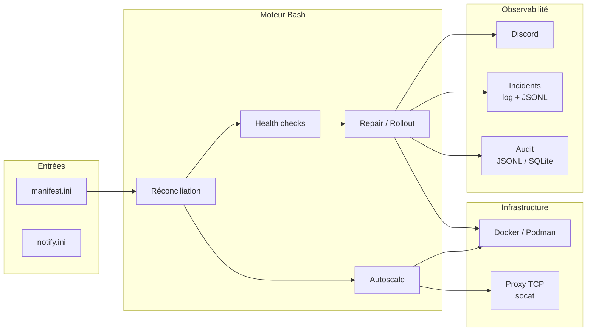

# Caelix — Orchestration Docker auto-réparatrice

<p align="center">
  
</p>

<p align="center"><strong>Orchestrateur Docker auto-réparateur — mono-hôte ou cluster HA</strong></p>

---

## Présentation

Caelix est un orchestrateur déclaratif pour conteneurs Docker. Les services sont définis dans un fichier INI. Le moteur assure la convergence vers l'état désiré via une boucle de réconciliation continue. Il fonctionne **en mono-hôte** par défaut, et **en cluster hautement disponible** en option — un cluster **HA par conception** que l'on **pilote comme un mono-hôte** depuis la console : chaque nœud est serveur Consul + controller, une **VIP flottante** offre une adresse stable qui **bascule automatiquement**, l'état de la console est partagé, et on **pilote le Docker de n'importe quel nœud** depuis l'UI.

**Capacités principales :**

- Réconciliation déclarative avec détection d'écarts
- Health checks HTTP, TCP, mémoire, OOM, latence, error rate, logs, disque
- Réparation automatique par escalade (restart → recreate → purge)
- Déploiement blue/green avec validation pré-bascule
- Autoscaling horizontal avec load balancer TCP intégré (socat)
- **Cluster HA (2.0)** : plan de contrôle Consul (quorum Raft), **VIP flottante** avec **bascule automatique**, maillage WireGuard obligatoire, **état console partagé** (utilisateurs, secret JWT, config, templates, stacks Compose, certs TLS), **Docker par nœud** (`X-Caelix-Node`), et **HPA** horizontal sur le CPU
- Alertes Discord avec diagnostic détaillé
- Audit trail JSONL ou SQLite
- Console web Vue 3 + FastAPI (~189 opérations REST, auth par cookie httpOnly)

---

## Architecture



---

## Stack technique

| Composant | Technologie |
|---|---|
| Moteur | Bash 5, curl, Docker/Podman |
| Proxy | socat (TCP round-robin, hot-reload) |
| Backend UI | Python 3.11+, FastAPI, SSE |
| Frontend UI | Vue 3, TypeScript, Tailwind CSS, Vite |
| Notifications | Discord webhooks |
| Audit | JSONL ou SQLite |

---

## Structure du projet

```
caelix/
├── bin/caelix                    # CLI (9 commandes)
├── lib/                        # Moteur Bash
│   ├── common.sh               #   Logging, gestion d'état, allocation de ports
│   ├── manifest.sh             #   Parseur INI
│   ├── runtime.sh              #   Abstraction Docker/Podman
│   ├── health.sh               #   8 types de health checks
│   ├── repair.sh               #   Escalade de réparation, blue/green
│   ├── autoscale.sh            #   Gestion de replicas, métriques, décisions
│   ├── proxy.sh                #   Reverse-proxy TCP
│   ├── notify.sh               #   Notifications Discord
│   ├── incidents.sh            #   Journal d'incidents
│   ├── audit.sh                #   Hook d'audit Bash
│   ├── doctor.sh               #   Validation et diagnostic
│   ├── audit_log.py            #   Persistence JSONL/SQLite
│   └── manifest_doctor.py      #   Validation avancée Python
├── etc/                        # Configuration
│   ├── manifest.ini            #   Services déclarés
│   └── notify.ini              #   Webhook Discord
├── ui/                         # Console web
│   ├── backend/                #   FastAPI (~27 routers, ~189 opérations)
│   ├── frontend/               #   Vue 3 SPA
│   └── Dockerfile              #   Multi-stage build
├── scripts/                    # Installation et maintenance
├── .caelix/                      # Données runtime
├── caelix.global.service         # Unit systemd
└── VERSION                     # 2.0.0-beta.1
```

---

## Quickstart

=== "Installation automatique"

    ```bash
    git clone https://github.com/Arcneell/Caelix.git
    cd Caelix
    ./scripts/install-all.sh
    ```

=== "Installation manuelle"

    ```bash
    git clone https://github.com/Arcneell/Caelix.git
    cd Caelix
    cp etc/manifest.ini.example etc/manifest.ini
    cp etc/notify.ini.example etc/notify.ini
    bin/caelix validate
    bin/caelix run
    ```

=== "Cluster HA (2.0, opt-in)"

    Tirez le canal beta (`:2.0.0-beta.1` ou `:beta`) ; amorcez un controller avec une VIP flottante, puis rattachez les autres nœuds :

    ```bash
    INSTALL="ghcr.io/arcneell/caelix:2.0.0-beta.1"

    # Nœud controller — bootstrappe Consul + porte la VIP
    docker run --rm $INSTALL cat /opt/caelix/install.sh | bash -s -- \
      --with-systemd --mode controller --vip 10.0.0.10/32 --admin-password 'IDENTIQUE_SUR_TOUS'

    # Nœuds à rattacher — pointez vers l'API Consul d'un controller existant
    docker run --rm $INSTALL cat /opt/caelix/install.sh | bash -s -- \
      --with-systemd --mode join --consul-addr http://10.0.0.11:8500 --admin-password 'IDENTIQUE_SUR_TOUS'
    ```

    Console et ingress répondent alors sur la VIP (`http://10.0.0.10:18100`), qui suit le leader à la bascule (`caelix vip-status`).

:material-arrow-right: [Guide d'installation complet](getting-started/installation.md)

---

## Sommaire

| Section | Contenu |
|---|---|
| [Démarrage](getting-started/installation.md) | Installation, premier lancement, déploiement de la doc |
| [Architecture](architecture/overview.md) | Composants, flux de réconciliation, répertoire d'état |
| [Cluster](architecture/cluster.md) | Cluster HA : plan de contrôle Consul, VIP flottante, état partagé, HPA |
| [Configuration](configuration/manifest.md) | Manifest INI, notifications Discord, variables d'environnement |
| [Modules](modules/health.md) | Health, repair, autoscale, proxy, audit, incidents, notifications |
| [Console Web](ui/overview.md) | UI, API REST, frontend |
| [Référence](reference/cli.md) | CLI, configuration exhaustive, fonctions internes, troubleshooting |
