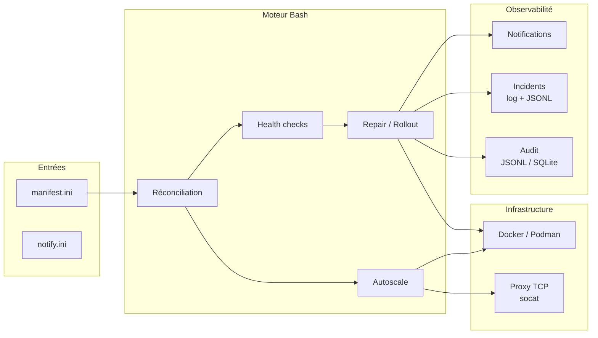

# Caelix

<p align="center">
  
</p>

<p align="center">Orchestration Docker auto-réparatrice, pour un hôte unique ou un cluster haute disponibilité.</p>

---

## Présentation

Caelix est un orchestrateur de conteneurs déclaratif. Les services sont décrits
dans un fichier INI ; une boucle de réconciliation continue compare cet état désiré
à ce que Docker exécute réellement et corrige les écarts. Caelix fonctionne en
mono-hôte par défaut et, en option, en cluster haute disponibilité piloté depuis la
console comme s'il s'agissait d'un seul hôte : chaque nœud est membre etcd et
controller, une VIP flottante fournit une adresse stable qui bascule
automatiquement, l'état de la console est répliqué entre les nœuds, et une seule
interface pilote le Docker de n'importe quel nœud.

Capacités principales :

- Réconciliation déclarative avec détection d'écarts.
- Health checks HTTP, TCP, mémoire, OOM, latence, taux d'erreur, logs et disque.
- Réparation automatique par escalade (restart, recreate, purge).
- Déploiement blue/green avec validation avant bascule.
- Autoscaling horizontal derrière un load balancer TCP intégré (socat).
- Cluster HA : plan de contrôle etcd (quorum Raft), VIP flottante avec bascule
  automatique, maillage WireGuard, état console partagé (utilisateurs, secret JWT,
  configuration, templates, stacks Compose, certificats TLS), Docker par nœud
  (`X-Caelix-Node`) et autoscaling sur le CPU.
- Notifications multi-canaux (Discord, Slack, Teams, Telegram, SMTP).
- Journal d'audit JSONL ou SQLite.
- Console web Vue 3 et backend FastAPI (environ 189 opérations REST, authentification
  par cookie `httpOnly`).

---

## Architecture



---

## Pile technique

| Composant | Technologie |
|---|---|
| Moteur | Bash 5, curl, Docker/Podman |
| Proxy | socat (TCP round-robin, rechargement à chaud) |
| Backend de la console | Python 3.11+, FastAPI, SSE |
| Frontend de la console | Vue 3, TypeScript, Tailwind CSS, Vite |
| Contrôle de cluster | etcd (KV, lease + transaction put-if-absent), WireGuard |
| Notifications | Discord, Slack, Teams, Telegram, SMTP |
| Audit | JSONL ou SQLite |

---

## Structure du projet

```
caelix/
├── bin/caelix                  # CLI
├── lib/                        # Moteur Bash
│   ├── common.sh               #   Logging, gestion d'état, allocation de ports
│   ├── manifest.sh             #   Parseur INI
│   ├── runtime.sh              #   Abstraction Docker/Podman
│   ├── health.sh               #   Health checks
│   ├── repair.sh               #   Escalade de réparation, blue/green
│   ├── autoscale.sh            #   Replicas, métriques, décisions
│   ├── proxy.sh                #   Reverse-proxy TCP
│   ├── notify.sh               #   Notifications
│   ├── incidents.sh            #   Journal d'incidents
│   ├── node.sh                 #   Agent de cluster (VIP, mesh, registre)
│   ├── doctor.sh               #   Validation et diagnostic
│   ├── audit_log.py            #   Persistance JSONL/SQLite
│   └── manifest_doctor.py      #   Validation avancée
├── etc/                        # Configuration (manifest.ini, notify.ini)
├── ui/
│   ├── backend/                #   FastAPI (~27 routers, ~189 opérations)
│   ├── frontend/               #   Vue 3
│   └── Dockerfile              #   Build multi-stage
├── scripts/                    # Installation et maintenance
├── .caelix/                    # Données runtime
└── VERSION                     # 2.0.1
```

---

## Démarrage rapide

=== "Image (recommandé)"

    ```bash
    echo "VOTRE_TOKEN" | docker login ghcr.io -u Arcneell --password-stdin
    docker run --rm ghcr.io/arcneell/caelix:latest cat /opt/caelix/install.sh | bash -s -- --with-systemd
    ```

=== "Depuis les sources"

    ```bash
    git clone https://github.com/Arcneell/Caelix.git
    cd Caelix
    cp etc/manifest.ini.example etc/manifest.ini
    cp etc/notify.ini.example etc/notify.ini
    bin/caelix validate
    bin/caelix run
    ```

=== "Cluster HA"

    Amorcez un controller avec une VIP flottante, puis rattachez les autres nœuds :

    ```bash
    IMAGE="ghcr.io/arcneell/caelix:latest"

    # Controller : amorce etcd et porte la VIP
    docker run --rm $IMAGE cat /opt/caelix/install.sh | bash -s -- \
      --with-systemd --mode controller --vip 10.0.0.10/32 --admin-password 'IDENTIQUE_SUR_TOUS'

    # Nœud à rattacher : pointez vers l'API etcd d'un controller existant
    docker run --rm $IMAGE cat /opt/caelix/install.sh | bash -s -- \
      --with-systemd --mode join --store-addr http://10.0.0.11:2379 --admin-password 'IDENTIQUE_SUR_TOUS'
    ```

    La console et l'ingress répondent alors sur la VIP (`http://10.0.0.10:18100`),
    qui suit le leader à la bascule (`caelix vip-status`).

:material-arrow-right: [Guide d'installation complet](getting-started/installation.md)

---

## Sommaire

| Section | Contenu |
|---|---|
| [Démarrage](getting-started/installation.md) | Installation, premier lancement, déploiement de la documentation |
| [Architecture](architecture/overview.md) | Composants, flux de réconciliation, répertoire d'état |
| [Cluster](architecture/cluster.md) | Cluster HA : plan de contrôle etcd, VIP flottante, état partagé, autoscaling |
| [Configuration](configuration/manifest.md) | Manifest INI, notifications, variables d'environnement |
| [Modules](modules/health.md) | Health, repair, autoscale, proxy, audit, incidents, notifications |
| [Console web](ui/overview.md) | Interface, API REST, frontend |
| [Référence](reference/cli.md) | CLI, configuration exhaustive, fonctions internes, dépannage |
