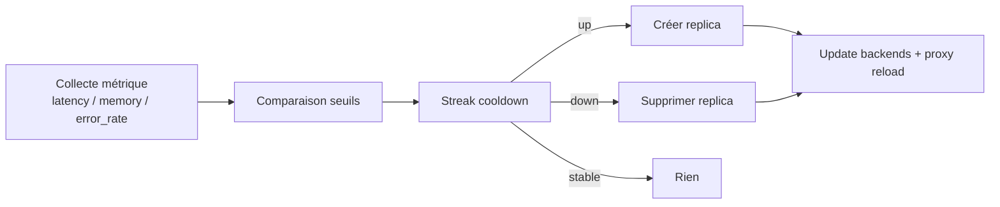
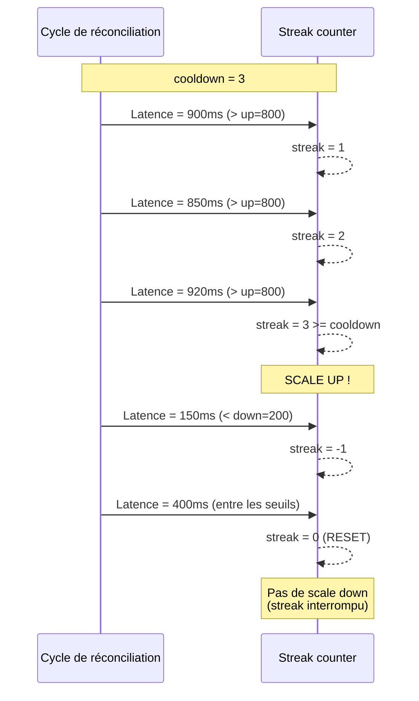
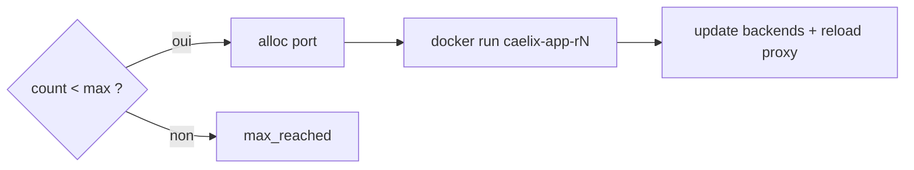
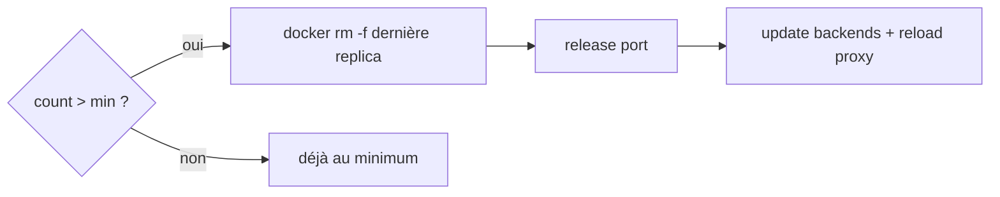

# Autoscale

Le module `autoscale.sh` implémente le scaling horizontal : gestion de replicas, collecte de métriques, décisions de scaling avec cooldown, et pilotage du load balancer intégré.

Caelix propose deux autoscalers distincts, qui coexistent :

- **Autoscale mono-hôte** (`autoscale.sh`, clé `autoscale = 1`). Décrit dans la
  majeure partie de cette page. Crée des replicas `caelix-<app>-rN` sur un seul hôte,
  derrière le load balancer socat par application.
- **HPA cluster** (clé `hpa = 1`). Décrit dans la section
  [HPA cluster](#hpa-cluster) ci-dessous. **C'est le chemin par défaut en cluster** :
  le leader ajuste le `total_replicas` d'un service et le scheduler/ingress répartissent
  les replicas sur les nœuds.

---

## Vue d'ensemble



---

## Activation

```ini
[mon-service]
autoscale = 1                    # Activer l'autoscaling
autoscale_min = 2                # Minimum de replicas
autoscale_max = 6                # Maximum de replicas
autoscale_container_port = 8080  # Port interne des replicas
```

Quand `autoscale = 1`, Caelix ne crée pas un conteneur `caelix-<app>` unique mais des replicas `caelix-<app>-r1`, `caelix-<app>-r2`, etc. gérées derrière un load balancer.

---

## Gestion des replicas

### Nommage et labels

| Élément | Convention | Exemple |
|---|---|---|
| Conteneur | `caelix-<app>-r<N>` | `caelix-web-r1`, `caelix-web-r2` |
| Label app | `caelix.app=<app>` | `caelix.app=web` |
| Label role | `caelix.role=replica` | — |
| Label index | `caelix.replica=<N>` | `caelix.replica=3` |

### Allocation de ports

Chaque replica a besoin d'un port hôte unique pour exposer son service.

=== "Mode explicite"

    ```ini
    autoscale_port_base = 18500
    # Replica 1 → 18500
    # Replica 2 → 18501
    # Replica 3 → 18502
    ```

=== "Mode automatique"

    ```ini
    [proxy]
    autoscale_port_range = 18500-18999
    # Caelix alloue le prochain port libre dans la plage
    ```

L'allocation est persistée dans `.caelix/autoscale/port_allocations` avec un verrou `flock` pour l'atomicité.

Fonctions impliquées :

| Fonction | Description |
|---|---|
| `port_alloc_init()` | Initialise le fichier d'allocation |
| `port_alloc_get(app, idx)` | Retrouve un port existant |
| `port_alloc_next(app, idx)` | Alloue le prochain port libre |
| `port_alloc_release(app)` | Libère tous les ports d'un service |
| `port_alloc_release_one(app, idx)` | Libère un seul port |

### Fichier backends

Chaque service autoscalé a un fichier `.caelix/autoscale/<app>.backends` :

```
caelix-web-r1 127.0.0.1 18501
caelix-web-r2 127.0.0.1 18502
caelix-web-r3 127.0.0.1 18503
```

Ce fichier est mis à jour par `autoscale_write_backends_file()` à chaque cycle. Seules les replicas en marche sont incluses.

---

## Métriques de scaling

### http_latency (défaut)

Mesure le temps de réponse HTTP en millisecondes.

```ini
autoscale_metric = http_latency
autoscale_up_threshold = 800     # Scale up si latence > 800ms
autoscale_down_threshold = 200   # Scale down si latence < 200ms
```

La métrique est collectée via `http_total_time_ms()` sur le chemin `autoscale_health_path`.

### memory

Mesure la mémoire moyenne des replicas en Mo.

```ini
autoscale_metric = memory
autoscale_up_threshold = 400     # Scale up si moyenne > 400 Mo
autoscale_down_threshold = 100   # Scale down si moyenne < 100 Mo
```

La métrique est collectée via `container_memory_usage_mb()` sur chaque replica, puis moyennée.

### http_error_rate

Mesure le taux d'erreur HTTP (5xx + timeouts) en pourcentage.

```ini
autoscale_metric = http_error_rate
autoscale_up_threshold = 25      # Scale up si erreurs > 25%
autoscale_down_threshold = 5     # Scale down si erreurs < 5%
```

### Métriques multiples

```ini
autoscale_metric = http_latency,memory
```

Quand plusieurs métriques sont définies, la décision utilise la plus critique.

---

## Système de streak et cooldown

Le scaling n'est pas réactif. Caelix attend plusieurs cycles consécutifs au-dessus ou en-dessous du seuil avant d'agir, ce qui évite les oscillations.



```ini
autoscale_cooldown = 3   # Nombre de passages consécutifs avant action
```

Logique de `autoscale_decision()` :

| Condition | Action sur streak | Décision |
|---|---|---|
| valeur > up_threshold | streak++ | Si streak >= cooldown → `up` |
| valeur < down_threshold | streak-- | Si streak <= -cooldown → `down` |
| Entre les deux | streak = 0 | `stable` |

L'état du streak est persisté dans `.caelix/state/<app>.autoscale_cooldown`.

---

## Scale UP



## Scale DOWN



---

## Vérification des replicas

À chaque cycle, `autoscale_check_replicas()` s'assure que toutes les replicas de 1 à `current_count` existent et tournent :

- **Replica disparue** → `autoscale_recreate_replica()` + incident `autoscale_replica_disappeared`
- **Replica arrêtée** → `docker start` ou recreate si échec + incident `autoscale_replica_stopped`

---

## Modes de proxy

### Mode legacy (par service)

```ini
[mon-service]
autoscale_lb_publish = 127.0.0.1:8080:80
```

Un processus proxy dédié est lancé pour ce service uniquement.

### Mode global

```ini
[proxy]
listen = 0.0.0.0:8080
autoscale_port_range = 18500-18999
health_interval = 3
connect_timeout = 5
```

Un seul proxy global gère tout le trafic. Le routage est configuré par service :

```ini
# Par hostname (header Host)
[web]
autoscale_route = host:www.example.com

# Par chemin URL (prefix match)
[api]
autoscale_route = path:/api

# Port dédié (proxy séparé sur ce port)
[admin]
autoscale_route = port:9090

# Route par défaut (catch-all)
[fallback]
autoscale_route = default
```

### Mode port dédié

Quand `autoscale_route = port:9090`, Caelix lance un proxy séparé sur le port 9090 via `_autoscale_lb_ensure_dedicated()`. Ce proxy est indépendant du proxy global.

---

## Cycle complet de réconciliation autoscale

| Étape | Fonction | Description |
|---|---|---|
| 1 | `autoscale_scale_up()` x N | Assurer le minimum de replicas |
| 2 | `autoscale_check_replicas()` | Vérifier que chaque replica existe et tourne |
| 3 | `autoscale_lb_ensure()` | Démarrer le proxy si absent |
| 4 | `autoscale_process_proxy_events()` | Traiter les transitions de santé (events.queue) |
| 5 | `autoscale_write_backends_file()` | Mettre à jour la liste des backends |
| 6 | `autoscale_collect_metric()` | Mesurer la métrique configurée |
| 7 | `autoscale_decision()` | Décider : up, down ou stable |
| 8 | `scale_up()` / `scale_down()` | Appliquer la décision |

---

## Nettoyage

La fonction `autoscale_cleanup(app)` est appelée quand un service est retiré du manifest :

1. Arrêter le proxy (`autoscale_lb_stop`)
2. Supprimer toutes les replicas
3. Libérer les ports alloués (`port_alloc_release`)
4. Nettoyer les fichiers de backends et d'état

---

## Exemple complet

```ini
[orchestrator]
interval = 8

[proxy]
listen = 0.0.0.0:80
autoscale_port_range = 18500-18999
health_interval = 3
connect_timeout = 5

[api]
image = api:latest
autoscale = 1
autoscale_min = 2
autoscale_max = 8
autoscale_container_port = 3000
autoscale_metric = http_latency,memory
autoscale_up_threshold = 600
autoscale_down_threshold = 150
autoscale_cooldown = 3
autoscale_health_path = /health
autoscale_route = host:api.example.com
health_type = http
health_url = http://127.0.0.1:3000/health
monitoring_types = all
env = NODE_ENV=production;LOG_LEVEL=info
memory_limit_mb = 512
```

---

## HPA cluster {#hpa-cluster}

Le HPA cluster (`ui/backend/app/core/cluster/hpa.py`) est l'autoscaler horizontal
du mode multi-nœud, et **le chemin par défaut en cluster**. Il est distinct de
l'autoscale mono-hôte ci-dessus : au lieu de gérer des replicas `caelix-<app>-rN` sur un
hôte, il ajuste le `total_replicas` d'un service dans le manifest cluster, et le scheduler
et l'ingress se chargent ensuite de placer et de load-balancer les replicas sur les nœuds,
exactement comme si on changeait `total_replicas` à la main, mais automatiquement.

En cluster, le nombre de replicas d'un service est son `total_replicas` dans le manifest
cluster.

### Activation

Opt-in par service, dans le manifest cluster :

```ini
[web]
image = myapp:latest
total_replicas = 2
hpa = 1            # active le HPA cluster
hpa_min = 2        # borne basse de total_replicas
hpa_max = 8        # borne haute de total_replicas
hpa_target = 60    # cible CPU % (défaut 60)
hpa_cooldown = 3   # ticks consécutifs avant d'agir (défaut 2)
```

| Clé | Défaut | Description |
|---|---|---|
| `hpa` | `0` | Active l'autoscaler cluster (`1`/`true`) |
| `hpa_min` | `1` | Borne basse de `total_replicas` |
| `hpa_max` | (= min) | Borne haute de `total_replicas` |
| `hpa_metric` | (CPU) | Métrique surveillée |
| `hpa_target` | `60` | Cible (CPU %) visée |
| `hpa_cooldown` | `2` | Ticks consécutifs avant d'agir |

Ces clés font partie de `PLACEMENT_KEYS` : elles sont retirées du sous-manifest poussé
aux agents (l'agent ne voit que le `total_replicas` décidé par le leader).

### Fonctionnement

À chaque passe (`hpa_tick`), exécutée par le leader uniquement :

1. Pour chaque replica d'un service `hpa = 1`, le leader lit le CPU% du conteneur
   `caelix-<app>` via `docker stats --no-stream` en ciblant le démon Docker de chaque
   nœud (le même `docker_addr`/`X-Caelix-Node` que la console). Les échantillons sont
   moyennés (`_avg_cpu`).
2. La décision applique une hystérésis asymétrique :
   - scale up quand `moyenne > hpa_target` et `total_replicas < hpa_max` ;
   - scale down quand `moyenne < hpa_target × 0.5` et `total_replicas > hpa_min` ;
   - entre les deux, les compteurs sont remis à zéro (pas d'oscillation autour de la cible).
3. L'action n'a lieu qu'après `hpa_cooldown` ticks consécutifs dans le même sens, et
   modifie `total_replicas` d'une unité à la fois (borné par `[hpa_min, hpa_max]`).
4. Si le manifest change, il est réécrit dans le store ; le scheduler replace les
   replicas et l'ingress met à jour ses backends.

> Les compteurs de cooldown sont en mémoire dans la boucle leader. Un failover les
> remet à zéro sur le nouveau leader, ce qui est sans danger : le HPA réévalue
> simplement depuis la métrique live.

> Si aucune métrique live n'est encore disponible (replica absent / démon injoignable),
> le service est laissé inchangé pour cette passe.

### Scaling manuel en cluster

En cluster, un scale up/down manuel modifie le `total_replicas` du service dans le
manifest cluster (borné à `[hpa_min, hpa_max]`), plutôt que de lancer un conteneur replica
sur le nœud local. Le scheduler replace ensuite les replicas et l'ingress met à jour ses
backends, exactement comme pour une décision automatique du HPA.
