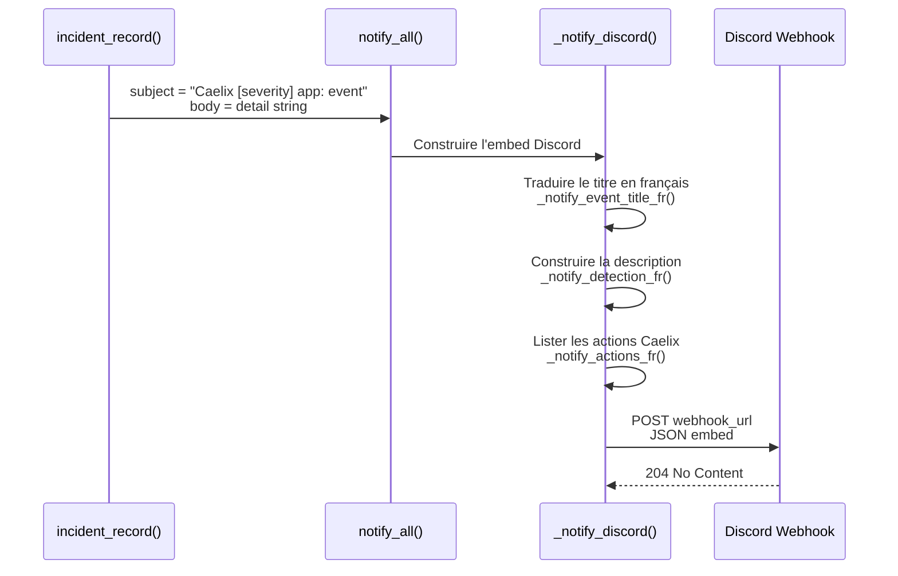
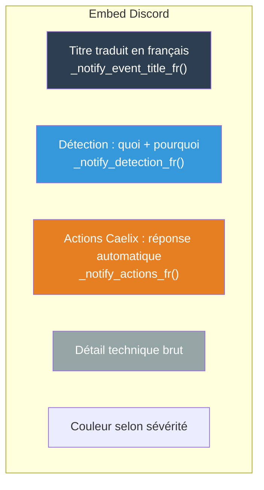

# Notifications

Le module `notify.sh` émet des alertes sur plusieurs canaux (Discord, Slack, Teams, Telegram, SMTP). Chaque notification est un message structuré contenant le diagnostic, la cause et les actions correctives.

---

## Vue d'ensemble



---

## Configuration

Fichier `etc/notify.ini` :

```ini
[discord]
enabled = 1
webhook_url = https://discord.com/api/webhooks/VOTRE_ID/VOTRE_TOKEN
```

### Créer un webhook Discord

1. Ouvrez votre serveur Discord
2. **Paramètres du serveur** → **Intégrations** → **Webhooks**
3. Cliquez **Nouveau webhook**
4. Choisissez le canal de destination
5. Copiez l'URL du webhook
6. Collez-la dans `etc/notify.ini`

### Tester la configuration

```bash
# Via l'API REST de la console web
curl -X POST http://localhost:8080/api/notify/test

# Manuellement avec curl
curl -X POST "https://discord.com/api/webhooks/ID/TOKEN" \
  -H "Content-Type: application/json" \
  -d '{"content": "Test Caelix"}'
```

---

## Structure d'un message Discord

Chaque notification est un **embed Discord** avec :



### Couleurs par sévérité

| Sévérité | Couleur | Code hex |
|---|---|---|
| `critical` | Rouge | `#e74c3c` |
| `warn` | Orange | `#f39c12` |
| `info` | Bleu | `#3498db` |
| `ok` | Vert | `#2ecc71` |

---

## Traductions françaises

### Titres d'événements (`_notify_event_title_fr`)

| Code événement | Titre français |
|---|---|
| `unhealthy` | Service en panne |
| `repair_restart` | Réparation : redémarrage |
| `repair_recreate` | Réparation : re-création |
| `repair_purge` | Réparation : purge complète |
| `repair_failed` | Échec de réparation |
| `escalade_max` | Seuil maximal d'échecs atteint |
| `recovery` | Service rétabli |
| `bluegreen_start` | Déploiement blue/green : début |
| `bluegreen_switch` | Déploiement blue/green : bascule |
| `bluegreen_fail` | Déploiement blue/green : échec |
| `autoscale_up` | Autoscale : ajout d'un replica |
| `autoscale_down` | Autoscale : suppression d'un replica |
| `autoscale_max_reached` | Autoscale : maximum atteint |
| `orphan_removed` | Conteneur orphelin supprimé |
| `manual_stop` | Arrêt manuel détecté |
| `proxy_backend_down` | Proxy : backend retiré de la rotation |
| `proxy_backend_up` | Proxy : backend réintégré |
| `autoscale_port_exhausted` | Autoscale : plage de ports épuisée |
| `autoscale_scale_up_failed` | Autoscale : échec de création du replica |
| `autoscale_lb_restarted` | Autoscale : proxy relancé après crash |
| `autoscale_replica_disappeared` | Autoscale : replica disparu |
| `autoscale_replica_stopped` | Autoscale : replica arrêté |
| `autoscale_recreate_failed` | Autoscale : échec de recréation |
| `runtime_unavailable` | Moteur conteneur indisponible |
| `container_create_failed` | Échec de création du conteneur |
| `manifest_duplicate_key` | Clé dupliquée dans le manifeste |
| `manifest_empty` | Manifeste sans application |
| `volume_remove_failed` | Échec de suppression d'un volume |

### Codes de raison (`_notify_reason_code_fr`)

| Code technique | Description française |
|---|---|
| `curl_echec_ou_timeout` | Échec de la requête curl ou timeout |
| `oom_killed` | Conteneur tué par manque de mémoire (OOM) |
| `memory_hard` | Seuil mémoire critique dépassé |
| `memory_soft` | Seuil mémoire d'avertissement dépassé |
| `http_code_XXX` | Code de réponse HTTP XXX |
| `tcp_refused` | Connexion TCP refusée |
| `high_latency` | Temps de réponse trop élevé |
| `high_error_rate` | Taux d'erreur HTTP trop élevé |
| `disk_full` | Utilisation disque trop élevée |
| `log_anomaly` | Anomalie détectée dans les logs |

### Descriptions détaillées (`_notify_detection_fr`)

Chaque événement génère une description Markdown détaillée expliquant **ce qui a été détecté** avec les valeurs spécifiques extraites du detail.

### Actions Caelix (`_notify_actions_fr`)

Chaque événement inclut une liste d'actions que Caelix entreprend ou recommande, sous forme de bullet points Markdown.

---

## Anti-spam

Mécanismes pour éviter le flood de notifications :

| Mécanisme | Description |
|---|---|
| `skip_discord` | Certains incidents marquent ce flag pour ne pas notifier |
| `manifest_load_warn.notified` | Flag qui empêche les alertes répétées sur la même erreur de manifest |
| Recovery unique | Un seul message quand le service redevient sain |
| `manual_pause_notified` | Ne pas alerter à chaque cycle sur une pause manuelle |
| `suspend_reconcile.notified` | Ne pas alerter à chaque cycle sur une suspension |
| Cooldown log anomaly | 10 minutes entre deux notifications d'anomalie de logs non bloquante par service |

---

## Notifications dans la console web

En parallèle des canaux externes, le backend Python maintient un système de notifications :

| Caractéristique | Détail |
|---|---|
| **Buffer** | 200 entrées max (circulaire) |
| **Persistence** | `.caelix/notifications.json` |
| **Types** | info, warning, error, success |
| **Temps réel** | SSE (Server-Sent Events) |

API :

| Méthode | Endpoint | Description |
|---|---|---|
| `GET` | `/api/notifications/` | Lister les notifications |
| `GET` | `/api/notifications/stream` | Flux SSE temps réel |
| `POST` | `/api/notify/save` | Sauvegarder la config notification |
| `POST` | `/api/notify/test` | Envoyer un message test |

---

## Désactiver les notifications

```ini
[discord]
enabled = 0
```

Les incidents continuent d'être enregistrés dans les logs et archives même si Discord est désactivé.

---

## Fonctions du module notify.sh

| Fonction | Description |
|---|---|
| `notify_load(path)` | Charger la configuration depuis notify.ini |
| `notify_get(section, key)` | Lire une valeur de config |
| `notify_get_default(section, key, default)` | Lecture avec fallback |
| `notify_all(subject, body)` | Point d'entrée : envoyer une notification |
| `_notify_discord(subject, body)` | Construire et poster l'embed Discord |
| `_notify_json_escape(s)` | Échapper une chaîne pour JSON |
| `_notify_event_title_fr(event)` | Titre français de l'événement |
| `_notify_reason_code_fr(raw)` | Description française du code de raison |
| `_notify_detection_fr(event, detail)` | Markdown de détection |
| `_notify_actions_fr(event, detail)` | Markdown des actions |
| `_notify_extract_kv(key, string)` | Extraire une valeur key=value |
