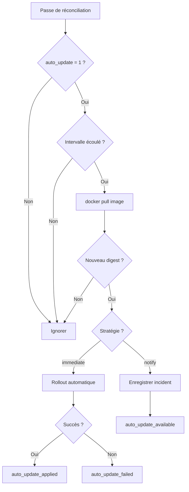

# Mise à jour automatique

Le module de mise à jour automatique (`lib/update.sh`) vérifie périodiquement si de nouvelles versions des images Docker sont disponibles dans le registre, et peut les appliquer automatiquement.

## Fonctionnement

À chaque passe de réconciliation, Caelix vérifie pour chaque service ayant `auto_update = 1` :

1. Vérification de l'intervalle : le délai configuré (`auto_update_interval`) est-il écoulé depuis le dernier check ?
2. Pull de l'image : `docker pull` récupère le dernier digest distant.
3. Comparaison des digests : le digest distant est-il différent du digest local stocké ?
4. Application de la stratégie, selon `auto_update_strategy` :
   - `immediate` : applique le rollout immédiatement (utilise `rollout_strategy` du service : `recreate` ou `blue_green`)
   - `notify` : enregistre un incident informatif sans toucher au conteneur



## Configuration

Clés à ajouter dans la section du service dans `manifest.ini` :

| Clé | Type | Défaut | Description |
|---|---|---|---|
| `auto_update` | bool | `0` | Activer la vérification automatique des mises à jour |
| `auto_update_interval` | string | `86400` | Intervalle entre les vérifications. Accepte un nombre de secondes ou : `hourly` (3600s), `daily` (86400s), `weekly` (604800s) |
| `auto_update_strategy` | string | `immediate` | Stratégie d'application : `immediate` (applique automatiquement) ou `notify` (alerte seulement) |

La stratégie de rollout utilisée lors de l'application dépend de `rollout_strategy` (`recreate` ou `blue_green`).

## Exemple

```ini
[my-app]
image = myapp:latest
auto_update = 1
auto_update_interval = daily
auto_update_strategy = immediate
rollout_strategy = blue_green
candidate_publish = 127.0.0.1:3001:3000
```

Avec cette configuration, Caelix vérifie une fois par jour si `myapp:latest` a un nouveau digest. Si oui, il effectue un rollout blue/green automatique.

### Mode notify

```ini
[my-app]
image = myapp:latest
auto_update = 1
auto_update_interval = hourly
auto_update_strategy = notify
```

Caelix vérifie toutes les heures et enregistre un incident `auto_update_available` si une mise à jour est détectée. L'application peut ensuite être déclenchée manuellement via l'UI ou l'API.

## Application manuelle

Lorsqu'une mise à jour est en attente (mode `notify`), elle peut être appliquée :

- Via l'API : `POST /api/update/apply/{name}`
- Via l'UI : depuis la page Services de l'orchestrateur

## Événements et notifications

| Événement | Sévérité | Description |
|---|---|---|
| `auto_update_available` | `info` | Nouvelle image détectée (mode notify) |
| `auto_update_apply` | `info` | Application d'une mise à jour en cours |
| `auto_update_applied` | `ok` | Mise à jour appliquée avec succès |
| `auto_update_failed` | `warn` | Échec du rollout de la mise à jour |

Ces événements sont envoyés sur tous les canaux de notification configurés (Discord, Slack, Teams, Telegram, SMTP).

## Fichiers d'état

| Fichier | Contenu |
|---|---|
| `.caelix/state/update_check_ts.<app>` | Timestamp du dernier check |
| `.caelix/state/update_digest.<app>` | Dernier digest connu de l'image |
| `.caelix/state/update_available.<app>` | Marqueur d'update en attente (mode notify) |

## Fonctions (lib/update.sh)

| Fonction | Description |
|---|---|
| `auto_update_enabled` | Vérifie si l'auto-update est activé pour un service |
| `auto_update_interval` | Retourne l'intervalle en secondes |
| `update_check_app` | Vérifie et applique les mises à jour pour un service |
| `update_check_all` | Vérifie tous les services (appelé dans la boucle de réconciliation) |
| `update_available` | Retourne vrai si une update est en attente |
| `update_apply_pending` | Applique manuellement une update en attente |
