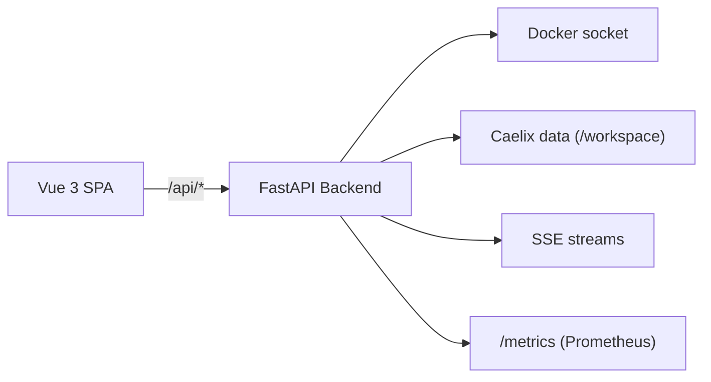

# Web Console

Web-based management and monitoring interface, built with FastAPI (REST backend + SSE) and Vue 3 (TypeScript SPA).

---

## Architecture



### Tech Stack

| Component | Technology | Version |
|---|---|---|
| Backend | Python / FastAPI | 3.11+ |
| Frontend | Vue 3 + TypeScript | 3.5 / TS 5.9 |
| Build | Vite | 8.x |
| Styling | Tailwind CSS | 4.x |
| Icons | Lucide | — |
| State management | Pinia | 3.x |
| Routing / i18n | Vue Router 4 + Vue I18n 11 | — |
| Container | Docker multi-stage | Node + Python Alpine |

---

## Getting Started

### Via Docker (production)

```bash
./scripts/deploy-ui.sh
```

The UI is accessible at `http://localhost:18100`.

For LAN access:

```bash
CAELIX_UI_PUBLISH_BIND=0.0.0.0 ./scripts/deploy-ui.sh
```

### Local Development

=== "Backend"

    ```bash
    cd ui/backend
    pip install -r requirements.txt
    uvicorn app.main:app --reload --port 8080
    ```

=== "Frontend"

    ```bash
    cd ui/frontend
    npm install
    npm run dev
    # → http://localhost:5173 (proxies /api to the backend)
    ```

---

## Authentication

Authentication is mandatory. Caelix uses a multi-user system with JWT and two roles (`admin` / `technicien`).

On first launch, an `admin` account is created with a random password, written to `/opt/caelix/.caelix/initial-admin-password`. Set `CAELIX_ADMIN_PASSWORD` to choose your own. There is no default `admin`/`admin` account.

The SPA authenticates via an httpOnly session cookie (`caelix_session`, `SameSite=strict`) set at login; the token is never stored in `localStorage`. CLI/API clients use the `Authorization: Bearer` header.

### API Login (CLI / scripts)

```bash
# 1. Get a JWT token
curl -X POST http://localhost:8080/api/auth/login \
  -H "Content-Type: application/json" \
  -d '{"username": "admin", "password": "your_password"}'

# 2. Use the token
curl -H "Authorization: Bearer eyJ..." http://localhost:8080/api/containers/
```

SSE streams use a single-use ticket (`EventSource` cannot set headers): call `POST /api/auth/sse-ticket`, then open the stream with `?ticket=<ticket>`.

See [Configuration > Authentication](../configuration/authentication.en.md) for full details (session cookie, SSE tickets, roles, security, user API).

---

## Navigation (v2.0)

The console was redesigned in v2.0: flat navigation (NetBird / Portainer style), cluster-native, with no nested collapsible menu groups. A single sidebar lists ~8 sections, each opening a page; multi-facet sections expose horizontal tabs.

| Section | Tabs | Content |
|---|---|---|
| **Overview** | — | Cluster topology dashboard: node cards (role / leader / VIP, health, CPU·RAM, per-node resource counts), cluster KPIs, quorum, recent incidents |
| **Nodes** *(cluster only)* | — | Node list with drain / undrain and per-node detail |
| **Containers** | Images · Volumes · Networks · System | Docker resource management (list, guided creation assistant, start/stop/restart, logs, exec, stats, pull/build, prune, connect/disconnect, system info) |
| **Services** | Services · Autoscale | Detailed orchestrated-service state and autoscale dashboard (metrics, replicas, thresholds, manual scale) |
| **Stacks** | Compose · Applications · Store | Docker Compose stacks, deployed applications, and the template catalog (deployment assistant) |
| **Ingress** | Domains · Certificates | Domains and TLS certificates |
| **Activity** | Logs · Events · Incidents · Journal | Centralized logs, real-time Docker events, filterable incidents, and the audit journal |
| **Settings** | General · Cluster | Users, notifications, preferences, and cluster settings |

### Header

The header shows the page title, a cluster status strip (leader · VIP · nodes alive · quorum), the language toggle (FR/EN), the light/dark theme toggle, the notifications bell, and the user menu. There is no global node selector anymore.

### Cluster-aware behaviour

The console is cluster-aware everywhere:

- resource lists aggregate across all nodes with a **Node** column and a per-node filter;
- every action targets its row's node;
- notifications aggregate alerts from all nodes; an event can target a node;
- long lists are virtualized and rendered progressively: a slow node does not block the display.

### Single-host simplification

In single-host mode the console simplifies automatically: no Nodes section, no Node column, and no cluster status strip in the header.

The console is bilingual FR/EN and ships light and dark themes.

### Infrastructure containers

The console container and the etcd store container run Caelix itself: removing them cuts the node off from its control plane. The **Containers** list therefore hides them by default. A **System** toggle reveals them (with a dedicated badge); any attempt to remove or stop one shows an explicit warning that the action may break the cluster.

### Animations and visual feedback

Transitions and loading states are treated as signal, not decoration:

- tables show an animated shimmer skeleton that mirrors the layout while data loads, instead of a blank screen followed by an abrupt pop-in;
- counters (running containers, images, live nodes…) tween to their value and pulse briefly when they change on a refresh;
- navigating between pages applies a short, consistent fade/slide;
- every animation honours the system `prefers-reduced-motion` preference and collapses to near-instant for motion-sensitive users.

---

## Mounted Volumes

The UI container requires two volumes:

| Host Volume | Container Target | Usage |
|---|---|---|
| Caelix project root | `/workspace` | Access to manifest, state, logs, bin/caelix |
| `/var/run/docker.sock` | `/var/run/docker.sock` | Communication with the Docker daemon |

---

## UI Environment Variables

| Variable | Default | Description |
|---|---|---|
| `PORT` | `8080` | Backend listen port |
| `CAELIX_UI_BIND` | `0.0.0.0` | Bind address |
| `CAELIX_ADMIN_PASSWORD` | (generated) | Initial admin account password (random if unset) |
| `CAELIX_JWT_SECRET` | (auto) | JWT signing key (auto-generated if absent) |
| `CAELIX_JWT_EXPIRE_MINUTES` | `480` | JWT token validity duration (minutes) |
| `CAELIX_RUNTIME` | (auto) | `docker` or `podman` |
| `CAELIX_UI_TLS_CERT` | — | TLS certificate path |
| `CAELIX_UI_TLS_KEY` | — | TLS key path |
| `CAELIX_METRICS_PROTECT` | `0` | Protect /metrics with authentication |
| `CAELIX_CORS_ORIGINS` | — | Allowed CORS origins (CSV). Empty = same-origin only (recommended) |
| `CAELIX_UI_VERBOSE` | `0` | Detailed HTTP logs |

---

## Frontend Components

| Component | Description |
|---|---|
| `DataTable` | Table with sorting, filtering, pagination |
| `StatusBadge` | Colored badge (running, stopped, unhealthy) |
| `JsonViewer` | Formatted JSON display |
| `ConfirmModal` | Confirmation dialog for destructive actions |
| `FeedbackToast` | Temporary notification (success, error, info) |
| `DeployProgress` | Deployment progress bar |
| `WizardModal` | Multi-step assistant |
| `ArrayField` | Form field for lists (ports, volumes, env) |
| `ContainerWizard` | Complete container creation form |
