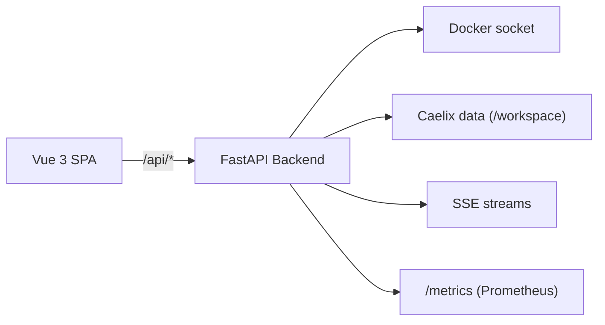

# Console Web

Interface web de gestion et de monitoring, construite avec FastAPI (backend REST + SSE) et Vue 3 (SPA TypeScript).

---

## Architecture



### Stack technique

| Composant | Technologie | Version |
|---|---|---|
| Backend | Python / FastAPI | 3.11+ |
| Frontend | Vue 3 + TypeScript | 3.5 / TS 5.9 |
| Build | Vite | 8.x |
| Style | Tailwind CSS | 4.x |
| Icônes | Lucide | — |
| State management | Pinia | 3.x |
| Routing / i18n | Vue Router 4 + Vue I18n 11 | — |
| Conteneur | Docker multi-stage | Node + Python Alpine |

---

## Démarrage

### Via Docker (production)

```bash
./scripts/deploy-ui.sh
```

L'UI est accessible sur `http://localhost:18100`.

Pour un accès LAN :

```bash
CAELIX_UI_PUBLISH_BIND=0.0.0.0 ./scripts/deploy-ui.sh
```

### Développement local

=== "Backend"

    ```bash
    cd ui/backend
    pip install -r requirements.txt
    uvicorn app.main:app --reload --port 8080
    ```

=== "Frontend"

    ```bash
    cd ui/frontend
    npm install
    npm run dev
    # → http://localhost:5173 (proxifié /api vers le backend)
    ```

---

## Authentification

L'authentification est obligatoire. Caelix utilise un systeme multi-utilisateurs avec JWT et deux roles (`admin` / `technicien`).

Au premier lancement, un compte `admin` est créé avec un mot de passe aléatoire, écrit dans `/opt/caelix/.caelix/initial-admin-password`. Définissez `CAELIX_ADMIN_PASSWORD` pour choisir le vôtre. Il n'y a pas de compte `admin`/`admin` par défaut.

La SPA s'authentifie via un cookie de session httpOnly (`caelix_session`, `SameSite=strict`) posé à la connexion ; le token n'est jamais stocké dans `localStorage`. Les clients CLI/API utilisent l'en-tête `Authorization: Bearer`.

### Connexion API (CLI / scripts)

```bash
# 1. Obtenir un token JWT
curl -X POST http://localhost:8080/api/auth/login \
  -H "Content-Type: application/json" \
  -d '{"username": "admin", "password": "votre_mot_de_passe"}'

# 2. Utiliser le token
curl -H "Authorization: Bearer eyJ..." http://localhost:8080/api/containers/
```

Les flux SSE utilisent un ticket à usage unique (`EventSource` ne supporte pas les en-têtes) : appeler `POST /api/auth/sse-ticket`, puis ouvrir le flux avec `?ticket=<ticket>`.

Voir [Configuration > Authentification](../configuration/authentication.md) pour les détails complets (cookie de session, tickets SSE, rôles, sécurité, API utilisateurs).

---

## Navigation (v2.0)

La console a été redessinée en v2.0 : navigation plate (style NetBird / Portainer), pensée pour le cluster, sans menus repliables imbriqués. Une barre latérale unique liste ~8 sections, chacune ouvrant une page ; les sections à plusieurs facettes exposent des onglets horizontaux.

| Section | Onglets | Contenu |
|---|---|---|
| **Overview** | — | Tableau de bord topologie du cluster : cartes de nœud (rôle / leader / VIP, santé, CPU·RAM, comptes de ressources par nœud), KPI cluster, quorum, incidents récents |
| **Nodes** *(cluster uniquement)* | — | Liste des nœuds avec drain / undrain et détail par nœud |
| **Containers** | Images · Volumes · Networks · System | Gestion des ressources Docker (liste, création via assistant guidé, start/stop/restart, logs, exec, stats, pull/build, prune, connect/disconnect, infos système) |
| **Services** | Services · Autoscale | État détaillé des services orchestrés et tableau de bord autoscale (métriques, replicas, seuils, scale manuel) |
| **Stacks** | Compose · Applications · Store | Stacks Docker Compose, applications déployées et catalogue de templates (assistant de déploiement) |
| **Ingress** | Domains · Certificates | Domaines et certificats TLS |
| **Activity** | Logs · Events · Incidents · Journal | Logs centralisés, événements Docker temps réel, incidents filtrables et journal d'audit |
| **Settings** | General · Cluster | Utilisateurs, notifications, préférences, et paramètres du cluster |

### En-tête

L'en-tête affiche le titre de la page, une bande de statut du cluster (leader · VIP · nœuds vivants · quorum), le basculement de langue (FR/EN), le bascule thème clair/sombre, la cloche de notifications et le menu utilisateur. Il n'y a plus de sélecteur de nœud global.

### Comportement orienté cluster

La console est consciente du cluster partout :

- les listes de ressources agrègent l'ensemble des nœuds avec une colonne **Node** et un filtre par nœud ;
- chaque action cible le nœud de sa ligne ;
- les notifications agrègent les alertes de tous les nœuds ; un événement peut cibler un nœud ;
- les longues listes sont virtualisées et rendues progressivement : un nœud lent ne bloque pas l'affichage.

### Simplification mono-hôte

En mode mono-hôte, la console se simplifie automatiquement : pas de section Nodes, pas de colonne Node, et pas de bande de statut cluster dans l'en-tête.

La console est bilingue FR/EN et propose les thèmes clair et sombre.

### Conteneurs d'infrastructure

Le conteneur de la console et le conteneur du store etcd font tourner Caelix lui-même : les supprimer coupe le nœud de son plan de contrôle. La liste **Containers** les masque donc par défaut. Un bouton **Système** les révèle (badge dédié) ; toute tentative de suppression ou d'arrêt affiche un avertissement explicite indiquant que l'action peut casser le cluster.

### Animations et retours visuels

Les transitions et états de chargement sont traités comme un signal, pas comme un effet décoratif :

- les tableaux affichent un squelette animé (shimmer) reproduisant la mise en page pendant le chargement, plutôt qu'un écran vide suivi d'une apparition brutale ;
- les compteurs (conteneurs actifs, images, nœuds vivants…) s'animent jusqu'à leur valeur et pulsent brièvement lorsqu'ils changent lors d'un rafraîchissement ;
- le changement de page applique un fondu/glissement court et cohérent ;
- toutes les animations respectent la préférence système `prefers-reduced-motion` et se réduisent à l'instantané pour les utilisateurs sensibles au mouvement.

---

## Volumes montés

Le conteneur UI nécessite deux volumes :

| Volume hôte | Cible dans le conteneur | Usage |
|---|---|---|
| Racine du projet Caelix | `/workspace` | Accès au manifest, state, logs, bin/caelix |
| `/var/run/docker.sock` | `/var/run/docker.sock` | Communication avec le daemon Docker |

---

## Variables d'environnement de l'UI

| Variable | Défaut | Description |
|---|---|---|
| `PORT` | `8080` | Port d'écoute du backend |
| `CAELIX_UI_BIND` | `0.0.0.0` | Adresse de bind |
| `CAELIX_ADMIN_PASSWORD` | (généré) | Mot de passe initial du compte admin (aléatoire si non défini) |
| `CAELIX_JWT_SECRET` | (auto) | Clé de signature JWT (auto-générée si absent) |
| `CAELIX_JWT_EXPIRE_MINUTES` | `480` | Durée de validité des tokens JWT (minutes) |
| `CAELIX_RUNTIME` | (auto) | `docker` ou `podman` |
| `CAELIX_UI_TLS_CERT` | — | Chemin certificat TLS |
| `CAELIX_UI_TLS_KEY` | — | Chemin clé TLS |
| `CAELIX_METRICS_PROTECT` | `0` | Protéger /metrics par authentification |
| `CAELIX_CORS_ORIGINS` | — | Origines CORS autorisées (CSV). Vide = même origine uniquement (recommandé) |
| `CAELIX_UI_VERBOSE` | `0` | Logs HTTP détaillés |

---

## Composants frontend

| Composant | Description |
|---|---|
| `DataTable` | Tableau avec tri, filtrage, pagination |
| `StatusBadge` | Badge coloré (running, stopped, unhealthy) |
| `JsonViewer` | Affichage JSON formatté |
| `ConfirmModal` | Dialogue de confirmation pour actions destructives |
| `FeedbackToast` | Notification temporaire (succès, erreur, info) |
| `DeployProgress` | Barre de progression déploiement |
| `WizardModal` | Assistant multi-étapes |
| `ArrayField` | Champ formulaire pour listes (ports, volumes, env) |
| `ContainerWizard` | Formulaire complet de création conteneur |
